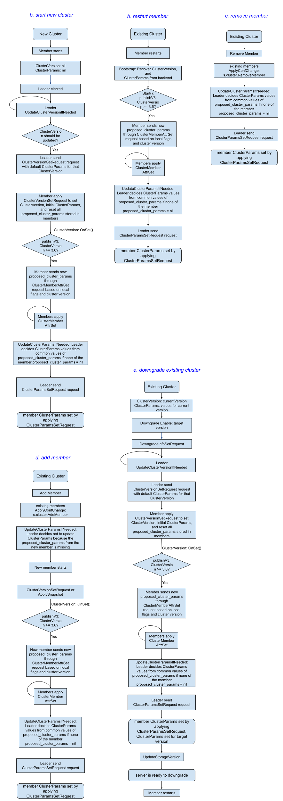

# KEP-4647: Cluster Feature Gate in etcd

<!-- toc -->
- [Release Signoff Checklist](#release-signoff-checklist)
- [Summary](#summary)
- [Motivation](#motivation)
  - [Goals](#goals)
  - [Non-Goals](#non-goals)
- [Proposal](#proposal)
  - [User Stories (Optional)](#user-stories-optional)
    - [Story 1: Developing Features Impacting the Apply Loop](#story-1-developing-features-impacting-the-apply-loop)
    - [Story 2](#story-2)
    - [Story 3](#story-3)
  - [Notes/Constraints/Caveats (Optional)](#notesconstraintscaveats-optional)
    - [Should we allow users to change feature gate value from etcd endpoints?](#should-we-allow-users-to-change-feature-gate-value-from-etcd-endpoints)
  - [Risks and Mitigations](#risks-and-mitigations)
    - [Data Compatibility Risks during Feature Value Change](#data-compatibility-risks-during-feature-value-change)
    - [Feature Implementation Change Risks](#feature-implementation-change-risks)
- [Design Details](#design-details)
  - [Register New Feature Gates](#register-new-feature-gates)
  - [Set the Feature Gates](#set-the-feature-gates)
  - [Consensus Algorithm](#consensus-algorithm)
    - [New Raft Proto Changes](#new-raft-proto-changes)
    - [New Backend Schema Changes](#new-backend-schema-changes)
    - [Start a New Cluster](#start-a-new-cluster)
    - [Restart a Member](#restart-a-member)
    - [Remove a New Member](#remove-a-new-member)
    - [Add a New Member](#add-a-new-member)
    - [Cluster Upgrade](#cluster-upgrade)
    - [Cluster Online Downgrade](#cluster-online-downgrade)
    - [Cluster Offline Downgrade](#cluster-offline-downgrade)
  - [How Learner's Feature Gates Affects Cluster Feature Gates](#how-learners-feature-gates-affects-cluster-feature-gates)
  - [Interface Change for Server Code](#interface-change-for-server-code)
  - [Client APIs Changes](#client-apis-changes)
  - [Feature Removal](#feature-removal)
  - [Test Plan](#test-plan)
      - [Prerequisite testing updates](#prerequisite-testing-updates)
      - [Unit tests](#unit-tests)
      - [Integration tests](#integration-tests)
      - [e2e tests](#e2e-tests)
  - [Graduation Criteria](#graduation-criteria)
    - [Milestone 1](#milestone-1)
    - [Milestone 2](#milestone-2)
    - [Milestone 3](#milestone-3)
  - [Upgrade / Downgrade Strategy](#upgrade--downgrade-strategy)
  - [Version Skew Strategy](#version-skew-strategy)
- [Implementation History](#implementation-history)
- [Drawbacks](#drawbacks)
- [Alternatives](#alternatives)
    - [Could it done on the client side instead of inside etcd?](#could-it-done-on-the-client-side-instead-of-inside-etcd)
  - [Configure new cluster feature gates globally and reject members reconnecting with different feature flags](#configure-new-cluster-feature-gates-globally-and-reject-members-reconnecting-with-different-feature-flags)
  - [Turn cluster features on/off explicitly after cluster starts](#turn-cluster-features-onoff-explicitly-after-cluster-starts)
  - [Push vs poll when leader decides cluster feature gate values](#push-vs-poll-when-leader-decides-cluster-feature-gate-values)
<!-- /toc -->

## Release Signoff Checklist

<!--
**ACTION REQUIRED:** In order to merge code into a release, there must be an
issue in [kubernetes/enhancements] referencing this KEP and targeting a release
milestone **before the [Enhancement Freeze](https://git.k8s.io/sig-release/releases)
of the targeted release**.

For enhancements that make changes to code or processes/procedures in core
Kubernetes—i.e., [kubernetes/kubernetes], we require the following Release
Signoff checklist to be completed.

Check these off as they are completed for the Release Team to track. These
checklist items _must_ be updated for the enhancement to be released.
-->

Items marked with (R) are required *prior to targeting to a milestone / release*.

- [ ] (R) Enhancement issue in release milestone, which links to KEP dir in [kubernetes/enhancements] (not the initial KEP PR)
- [ ] (R) KEP approvers have approved the KEP status as `implementable`
- [ ] (R) Design details are appropriately documented
- [ ] (R) Test plan is in place
- [ ] (R) Graduation criteria is in place
- [ ] "Implementation History" section is up-to-date for milestone
- [ ] User-facing documentation has been created in [etcd-io/website], for publication to [etcd.io]
- [ ] Supporting documentation—e.g., additional design documents, links to mailing list discussions/SIG meetings, relevant PRs/issues, release notes

<!--
**Note:** This checklist is iterative and should be reviewed and updated every time this enhancement is being considered for a milestone.
-->

[etcd.io]: https://etcd.io/
[kubernetes/enhancements]: https://git.k8s.io/enhancements
[kubernetes/kubernetes]: https://git.k8s.io/kubernetes
[etcd-io/website]: https://github.com/etcd-io/website

## Summary

We're introducing a mechanism to enable and verify feature enablement across all members of an etcd cluster. This provides a standardized way for contributors to develop features that impact the etcd apply loop, while giving users confidence that enabled features will function consistently across the entire cluster.

## Motivation

In [KEP-4578](https://github.com/kubernetes/enhancements/issues/4578), we introduced the feature gate framework into etcd, allowing users to configure feature gates on each member. However, this approach allows each member to run with different features, leading to potential inconsistencies in cluster behavior and data processing. This prevents users from reliably depending on a feature, as they might not know which server will handle their request, and it also hinders etcd contributors from creating features that impact the core etcd apply loop due to the risk of introducing inconsistencies.

For features that fundamentally influence the workings of the entire cluster we need a mechanism that ensures that all members agree on the feature enablement. To address these challenges, we propose introducing a cluster-wide feature enablement mechanism that ensures consistent feature activation across all members of an etcd cluster.

### Goals

* Cluster-Wide Feature Consistency: Establish a server-side mechanism to ensure that specific features are either enabled or disabled consistently across all members of an etcd cluster.
* Safe Feature Dependency: Provide a client-side mechanism that allows external systems and applications to reliably determine if a cluster-wide feature is enabled, enabling them to safely depend on and utilize that feature.

### Non-Goals

* Backporting a feature gate to a patch version is not supported.

## Proposal

### User Stories (Optional)

#### Story 1: Developing Features Impacting the Apply Loop

A developer is adding a new feature that modifies the etcd apply loop. This change could impact how data is processed and replicated across the cluster. An example of such a feature is [persisted lease checkpoints](https://github.com/etcd-io/etcd/pull/13508). Currently, enabling such a feature requires careful coordination and potentially taking the entire cluster down to ensure all members apply the changes consistently. This lack of flexibility restricts development and can lead to operational disruptions.

With cluster-wide feature enablement, we can enable or disable such features in a controlled manner, ensuring consistent behavior across all members during a rolling upgrade, while allowing users to enable/disable the feature as they wish. This empowers developers to iterate more quickly and safely, while also providing operators with greater flexibility to manage feature rollouts and upgrades without disrupting service.

#### Story 2

A Kubernetes developer would like use a new great etcd feature, but it is not available on all supported etcd versions. What can they do?
Historically, Kubernetes avoided using any features that were not available on all supported versions of etcd.
From K8s 1.31, Kubernetes added very complicated and fragile system: [`FeatureSupportChecker`](https://github.com/kubernetes/kubernetes/blob/db82fd1604ebf327ab74cde0a7158a8d95d46202/staging/src/k8s.io/apiserver/pkg/storage/etcd3/feature/feature_support_checker.go#L42) to detect etcd version, parse it and guess whether this feature based on a set of hardcoded etcd version. It does not really know if the feature is enabled by the feature `--experimental` flag.

With a client-side mechanism to reliably determine if a cluster-wide feature is enabled,  would allow Kubernetes to immediately utilize new features.

#### Story 3

In a HA cluster, users would like to turn off an enabled feature. They need to restart each server node one by one with feature changed from enabled to disabled. Today, after the restarting process begins and before all nodes are restarted, the behavior of the feature is really undefined: it is enabled on some nodes and disabled on the other nodes. For etcd developers, it's nearly impossible to consider and thoroughly test all the mixed enablement scenarios in a distributed system and ensure that feature maintains correctness during the undefined state. 

Now with the cluster feature gate, we can deterministically tell if the feature is enabled or disabled for the whole cluster at any moment and easier to write tests to ensure correctness.

This story applies similar to the upgrade/downgrade scenarios as well.

### Notes/Constraints/Caveats (Optional)

#### Should we allow users to change feature gate value from etcd endpoints?
In our proposal, the feature gates of a cluster can only be configured through the feature gate flags/config files when the cluster/members starts. Users cannot dynamically change feature gate values through some etcd endpoints.

The main downside of this restriction is that it requires member restart to change a feature value which might be to slow for some critical bugs. But the alternative would open a security pandora box by allowing clients to change etcd configuration from etcd endpoints.

### Risks and Mitigations

#### Data Compatibility Risks during Feature Value Change

There are some features that would need to touch data in the apply/storage layer. Disabling them might result in orphaned data or unrecognizable data that could be breaking.
How do we handle the data change? 
1. if the etcd server knows this feature, it should be able to handle the data when the feature is on or off. How it handles the data at WAL entry `i` is determined by the cluster feature flag set from raft before WAL entry `i`. 
1. if the etcd server does not know this feature, i.e. its version is not compatible with this feature, it means the data is not compatible with the storage version. The storage version migration should handle cleaning up older or newly introduced data.

Overall, when developers introduce new data with a feature, they should be careful to include data cleaning in `schema.UnsafeMigrate`. But we prefer not to have a mechanism to disallow such features to be turned off after they are turned on because new features could be buggy, we need to keep the option to be able to turn it off without bring down the whole cluster.

#### Feature Implementation Change Risks

There are cases when a developer wants to change how an existing feature works. This would make things complicated in a mixed version cluster. One member could have the old implementation while another member uses the latest implementation. How can we make sure the cluster works consistently?

Ideally, the developer should introduced a new feature if they want to do major changes. If that is not desirable, similar to [how Kubernetes handles feature gating changes for compatibility version](https://github.com/kubernetes/enhancements/tree/master/keps/sig-architecture/4330-compatibility-versions#feature-gating-changes), we need to keep the implementation history for at least 2 minor versions (allowed version skew) in the code base if the feature change affects data in anyway, like
```go
if s.FeatureEnabled(FeatureA) && s.ClusterVersion() <= "3.6" {implementation 1}
if s.FeatureEnabled(FeatureA) && s.ClusterVersion() >= "3.7" {implementation 2}
```
This way the cluster would work consistently because there is a single ClusterVersion across the whole cluster.

## Design Details

On high level, a cluster feature gate would need:
1. a way to [register new feature gates](#register-new-feature-gates) when a developer adds new features.
1. a way to [set the feature gates](#set-the-feature-gates) when each member starts up.
1. a [consensus algorithm](#consensus-algorithm) to determine if a feature is enabled for the whole cluster, even in mixed version scenarios.
1. an [interface](#interface-change-for-server-code) to query if a feature is enabled for the whole cluster to be used in the server code.
1. [client APIs](#client-apis-changes) to query if a feature is enabled for the whole cluster.
1. a way to [remove a feature gate][#feature-removal] when it is no longer useful or have graduated.

### Register New Feature Gates

A feature can be registered as server level feature or cluster level feature, but not both.
For data compatibility, we do not support changing a feature gate from one type to another. 
If a developer finds out that their feature needs to be a cluster level feature instead of server level after a release, they should add a new feature and use a new feature name.

```go
DefaultEtcdServerFeatureGates := map[Feature]VersionedSpecs {
		featureA: VersionedSpecs{
			{Version: mustParseVersion("3.6"), Default: false, PreRelease: Beta},
			{Version: mustParseVersion("3.7"), Default: true, PreRelease: GA},
		},
		featureB: VersionedSpecs{
			{Version: mustParseVersion("3.7"), Default: false, PreRelease: Alpha},
		},
}
DefaultEtcdClusterFeatureGates := map[Feature]VersionedSpecs {
		featureC: VersionedSpecs{
			{Version: mustParseVersion("3.7"), Default: false, PreRelease: Beta},
		},
		featureD: VersionedSpecs{
			{Version: mustParseVersion("3.6"), Default: false, PreRelease: Alpha},
			{Version: mustParseVersion("3.7"), Default: true, PreRelease: Deprecated},
		}
}
```

### Set the Feature Gates
To set the correct user expectation, we will add a new flag `--cluster-feature-gates` (+`config-file` configuration support) similar to the server `--feature-gates` to set the values of cluster feature gates as expected by the local server. The server will use this flag value to propose `proposed_feature_gates` to the cluster. The final values of the cluster feature gate are actually decided through raft consensus.

We do not support dynamically changing the feature gates when the server is running.

### Consensus Algorithm

To guarantee consistent value of if a feature is enabled in the whole cluster, the leader would decide if the feature is enabled for all cluster members, and propagate the information to all members. 

1. When an etcd server starts, the cluster feature gate would be set to nil, which means all cluster level features are disabled.

1. When there is an update in `ClusterVersion` or the server itself, the server would propose the values of cluster feature gates by publishing a new `Attributes.feature_gates` field [through raft](https://github.com/etcd-io/etcd/blob/e37a67e40b3f5ff8ef81f9de6e7f475f17fda32b/server/etcdserver/server.go#L1745). (see the [discussion](#push-vs-poll-when-leader-decides-cluster-feature-gate) about why we choose to push the information through raft)

1. When the leader received member attribute update from raft, it will decide the values for the cluster level features based on the proposed feature values of all members.

1. The leader sends the final feature values in `ClusterFeatureGateSetRequest` through raft. 

1. Each member apply the updates to their cluster feature gate, and save the results in the `cluster` bucket in the backend.



#### New Raft Proto Changes

```proto
message Feature {
  string name = 1;
  bool enabled = 2;
}

message Attributes {
  option (versionpb.etcd_version_msg) = "3.5";

  string name = 1;
  repeated string client_urls = 2;
  // the values of all cluster level feature gates set by the configuration of the member server.
  repeated Feature proposed_feature_gates = 3;
}

message ClusterFeatureGateSetRequest {
  option (versionpb.etcd_version_msg) = "3.5";

  // the values of all cluster level feature gates for the whole cluster.
  repeated Feature feature_gates = 1;
}
```

#### New Backend Schema Changes
We will save the values of cluster feature_gates in the `Cluster` bucket in the backend.

#### Start a New Cluster

Fig. a above shows how the consensus of feature gates is reached for a new cluster:
1. When the cluster starts, before `ClusterVersion` is set, the cluster feature gate would be `nil`, and all features would be considered disabled. 
1. Before the leader send an update message of the `ClusterVersion`, the leader will send a `ClusterFeatureGateSetRequest` message with empty `feature_gates` to reset any existing cluster feature gate. This is to make sure the feature gate is always compatible with the `ClusterVersion`.
1. Whenever the `ClusterVersionSet` is applied in a server, the member will propose the cluster feature gate values based on its own flags and the `ClusterVersion`.
1. Whenever the leader receives the `member.Attributes.proposed_feature_gates` from a member, it would try to do `UpdateClusterFeatureGate` by reconciling the `proposed_feature_gates` from all the members: 
   * if the `proposed_feature_gates` from any member is missing, the cluster feature gate will be empty, i.e. all features will be disabled.
     * [NOTE] the leader would wait for all the members to send in their `proposed_feature_gates` instead of just initialize the feature gate to the default values at the `ClusterVersion`, because different members might have different patch versions, and may not have the same default values. We do not want the feature values to flip-flop when the leader changes.
     * [NOTE] the leader would wait for all the members to send in their `proposed_feature_gates` instead of setting the feature gates based on the `proposed_feature_gates` it has received so far, because it generally better to move the feature gate from empty to the final step in one step, instead of changing it in N(member) number of steps and beining also dependent on the order of the messages the leader receives.
   * a feature is disabled if the feature is proposed to be `false` by any member
   * a feature is enabled only if the feature is proposed to be `true` by all members
   * a feature is disabled if it is missing from the proposal of any member.
1. The leader will send `ClusterFeatureGateSetRequest` through raft to set the final values of the cluster feature gate to all members. 

One drawback of this approach is that there is a period before the leader receives the proposals from all members when no feature would be available. The duration of this period is expected to be `O(time to set ClusterVersion)`. We think that is acceptable because if the time to set `ClusterVersion` is exceptionally long, the `ClusterVersion` would stay at the fallback version `3.0`, for which a lot of etcd capabilities would not be available anyway. It is better to wait than risking splitting minds about what the default values should be when relying on falling back to default values of the `ClusterVersion`.

#### Restart a Member

Fig. b above shows how the consensus of feature gates is reached when a member of an existing cluster restarts:
1. When the member bootstraps, it will load the saved `ClusterVersion` and `ClusterFeatureGates` from the backend. Since the `ClusterVersion` should be `<=` the server binary version when downgrade is not enabled, the `ClusterFeatureGates` should also be compatible with the server binary version (we do not allow feature backport).
1. After bootstrapping, the new server will use the new `--cluster-feature-gates` flag to update its new `proposed_feature_gates` through `member.Attributes` as part of the server [`Start()`](https://github.com/etcd-io/etcd/blob/67743348dcd2deb1819fded2336749449ebf95d2/server/etcdserver/server.go#L532) process.
1. The leader will received the updated `member.Attributes.proposed_feature_gates` message from the restarted member, and update the cluster feature gates for the whole cluster.

#### Remove a New Member

Fig. c above shows how the consensus of feature gates is reached when removing a member to an existing cluster:
1. When the leader apply the config change to remove a member, it will rerun the `UpdateClusterFeatureGate` logic, update the cluster feature gate based on the `proposed_feature_gates` of the remaining members, and send the updated cluster feature gate values to the whole cluster.

#### Add a New Member

Fig. d above shows how the consensus of feature gates is reached when adding a new member to an existing cluster:
1. When the cluster applies the ConfChange request to add a member, the leader will call `UpdateClusterFeatureGate` which will reset the cluster feature gate because `proposed_feature_gates` of the new member is missing.
1. After the member starts, it will update its `ClusterVersion` either by applying the `ClusterVersionSet` WAL entry or apply a snapshot. In both cases, the member will propose the cluster feature gate values based on its own flags and the `ClusterVersion` as part of the `OnSet()` call.
1. The leader decides and sends the new cluster feature gate values after it receives the `proposed_feature_gates` of the new member.

#### Cluster Upgrade

Cluster upgrade is very similar to [Restart a Member](#restart-a-member), except in the end, the `ClusterVersion` will be upgraded after all members have been upgraded. 
1. Before upgrading the `ClusterVersion`, the leader will send a request to reset the cluster feature gate first.
1. After upgrading the `ClusterVersion`, each member will send the new `proposed_feature_gates` based on local flags and the new higher `ClusterVersion`.
1. The leader will decide and update the final values of the cluster feature gate after it receives the new `proposed_feature_gates` from all members.

#### Cluster Online Downgrade

The online downgrade process is started by `etcdctl downgrade enable`.
1. Before downgrading the `ClusterVersion`, the leader will send a request to reset the cluster feature gate first.
1. After downgrading the `ClusterVersion`, each member will send the new `proposed_feature_gates` based on local flags and the new lower `ClusterVersion`.
1. The leader will decide and update the values of the cluster feature gate after it receives the new `proposed_feature_gates` from all members.
1. Now the cluster features and any new WAL entries should be compatible with the lower `ClusterVersion`.
1. The server will `UpdateStorageVersion`, and become ready to be downgraded.
1. Each server is restarted 1 by 1, and the cluster feature gate will be updated following the same process as in the [Restart a Member](#restart-a-member).

#### Cluster Offline Downgrade
If a feature is available in the lower version, the lower version should be able to handle its data.
If a feature is not available in the lower version, then its data should be already handled by the `UnsafeMigrate` function. 
So the only part we need to add to the offline downgrade process is in `UnsafeMigrate`, prune any feature:value pair that is not available to the target version.

### How Learner's Feature Gates Affects Cluster Feature Gates

When a new learner joins the cluster, it should not affects the cluster feature gates. 

On the other hand, the learner should use the same code path as the rest of the cluster, and be able to handle the same data. So we require the feature gates of the learner to be consistent with the cluster feature gates. If there are inconsistencies, the learner should not be allowed to join the cluster.

### Interface Change for Server Code

In `membership.RaftCluster`, we will add a new cluster level feature gate map to store the cluster level feature enablement. 
We use a raw map instead of a `featuregate.FeatureGate` because the defaults and locked functionalities are not useful for this use case as they might differ for different servers. 

```go
type RaftCluster struct {
  ...
  ClusterFeatureGate map[featuregate.Feature]bool
  ...
}

func (c *RaftCluster) FeatureEnabled(f featuregate.Feature) {
  if ClusterFeatureGate != nil && enabled, ok := ClusterFeatureGate[f]; ok {
    return enabled
  }
  // if feature is LockToDefault at c.version, return the default value.
  return false
}

func (s *EtcdServer) FeatureEnabled(f Feature) bool {
  // if f is registered in the cluster feature gate
  // return s.cluster.FeatureEnabled(f)
  // else 
  // return s.ServerFeatureGate.Enabled(f)
}

```

### Client APIs Changes

New client APIs will be added to query if a feature is enabled across the cluster. Because the client does not know which server they are talking to, we only expose cluster level features through these APIs.

For grpc, new rpc type would be added to the `Maintenance` service.

```proto
service Maintenance {
  ...
  rpc FeatureGateStatus(FeatureGateStatusRequest) returns (FeatureGateStatusResponse) {
    option (google.api.http) = {
      post: "/v3/maintenance/featuregate"
      body: "*"
    };
  }
  ...
}
message Feature {
  string name = 1;
  bool enabled = 2;
}
message FeatureGateStatusRequest {
  repeated string features = 2;
}
message FeatureGateStatusResponse {
  ResponseHeader header = 1;
  repeated Feature features = 3;
}
```

The clientv3 function would look like:

```go
package clientv3

type Maintenance interface {
  FeatureGateStatus(ctx context.Context, features ...string) (*FeatureGateStatusResponse, error)
}
```

The `etcdctl` commands could look like:
* `etcdctl endpoint featuregate $featureName` returns true if the feature is enabled

Because the feature gate of a cluster could change anytime, even if the client has queried the etcd cluster for feature availability before sending a request, feature availability can be changed by the time the request is sent. We are proposing to add a new `WithRequireFeature(ctx context.Context, featureName string) context.Context` function in `clientv3` package to pass metadada of the required feature into the context which could be checked against the server cluster feature gate to determined the request should be served. 

### Feature Removal

When a feature has graduated or turns out not to be useful, we do not want to keep the code path for both `FeatureA=true|false` anymore. 
For Alpha features, because the default values are `false`, they can be removed anytime.
For other types of cluster features, we require the the feature to go through the following 3 stages toward deprecation before bening removed:
1. Feature has been stable in the previous lifecyle for at least 1 minor release (no change of default values in any patch version of this minor version).
1. Feature has been stable in lifecyle `PreRelease: Deprecated, {Default: defaultVal, LockToDefault: true` for at least 1 minor release.
1. Feature can be removed in the next release.

The figure below shows an example of how a GA feature can be removed.


To ensure this works in mixed version scenarios, we require:
1. The `LockToDefault` state of a feature cannot be changed in patch version.
1. The `LockToDefault` state of a feature can only be set to be `true` if the feature has been stable for at least 1 minor version, which means no change of its default value in any patch version of the previous minor version.
1. The server would need to use the default value of the feature if `LockToDefault=true` even when the cluster feature gate is not set.


### Test Plan

[x] I/we understand the owners of the involved components may require updates to
existing tests to make this code solid enough prior to committing the changes necessary
to implement this enhancement.

##### Prerequisite testing updates

##### Unit tests

New feature gate unit tests will be added.

##### Integration tests

New feature gate integration tests will be added.

##### e2e tests

We will add one cluster level experimental features to the feature gate (without removing the original experimental flag), and add e2e tests to make sure the feature gate functions equivalently to their `--experimental-xxx` flags.

We will also add downgrade/upgrade e2e tests to make sure the feature gate does not break the cluster in mixed version cluster.

### Graduation Criteria

#### Milestone 1

* cluster level feature gate implemented.
  * new raft changes added.
  * cluster feature gate added to the server code, and used by a cluster level experimental feature.
  * feature metrics added.
  * e2e tests added for the feature gate equivalent of the selected experimental feature.
  * robustness tests added for current version.

#### Milestone 2
* cluster level feature gate client API implemented.
  * grpc endpoints added.
  * `clientv3` function added.
  * `etcdctl` command added.

#### Milestone 3

* cluster level feature gate fully tested.
  * backport necessary miminal changes to 3.5.
  * feature gates clean up added to `schema.UnsafeMigrate`.
  * e2e tests for upgrade & downgrade & mixed version scenarios completed.
  * robustness tests with upgrade & downgrade & mixed version scenarios completed. 
  * documentation.

### Upgrade / Downgrade Strategy

For regular downgrade process, `schema.UnsafeMigrate` should clean up feature gates that are not available in the target version.

The feature gate feature would available in 3.6+. 
In 3.5, the necessary proto changes and no-op raft changes would be backported, but feature gate would not be available. 
When upgrading/downgrading between 3.5 and 3.6, no feature would be enabled if there is at least one member with version 3.5.

If a user uses a 3.5 version that does not recognize the new proto field, it is recommended they should upgrade to the latest 3.5 release first before upgrading to 3.6. Since unknown fields is ignored by proto, etcd should still work even if they do not upgrade to latest 3.5 version.

### Version Skew Strategy

Since we are introducing some new raft request and data, we will backport the new proto changes into 3.5, but would not use them in any way affecting 3.5 etcd server.

## Implementation History

<!--
Major milestones in the lifecycle of a KEP should be tracked in this section.
Major milestones might include:
- the `Summary` and `Motivation` sections being merged, signaling SIG acceptance
- the `Proposal` section being merged, signaling agreement on a proposed design
- the date implementation started
- the first Kubernetes release where an initial version of the KEP was available
- the version of Kubernetes where the KEP graduated to general availability
- when the KEP was retired or superseded
-->

## Drawbacks

<!--
Why should this KEP _not_ be implemented?
-->

## Alternatives

#### Could it done on the client side instead of inside etcd? 
One could argue that it is easy to know if a feature enabled for the whole cluster by querying each member if the feature is enabled on the client side. But there are several caveates with this approach:
* not all members are available all the time. if some member is not available, it is questionable if the feature can be used, and that could break the HA assumption. 
* if there is a new operation that can only be used when a feature is enabled, there is no guarantee that the user or the etcd leader could check if the feature is enabled and then assume it will still be enabled when they send a following request or when a particular server applies the operations. 

As a strongly consistent and reliable data store, it is critical for etcd to provide consistent and predictable operations to the clients. So we have to do the feature coordination inside etcd. 

### Configure new cluster feature gates globally and reject members reconnecting with different feature flags

Instead of negotiating a common feature gate configuration after each member starts with their own feature gate flags, another way to guarantee consistencies of feature gate between different members is to allow configuring the feature gates of a new cluster globally when the cluster starts, and prevent a new/restarting member with an inconsistent feature gate from joining the cluster in the first place. 

Pros for this approach:
* no complex raft changes
* guarantee that feature gates would not change throughout the life of the cluster.

Cons for this approach:
* user changing the etcd manifests/config file might cause unexpected crashloop.
* impossible to do no downtime update of a feature, because the whole cluster needs to be brought down before changing a feature enablement.
* impossible to do no downtime upgrade/downgrade, because a new feature might be introduced in the new version, or the lifecycle of an existing feature could change, the whole cluster needs to be brought down before enabling a new feature or when encountering default/loked feature value conflicts.

Due to these strong limitations of this approach, we believe the proposed solution is a better approach even though the logic and implementation is more complex. 

### Turn cluster features on/off explicitly after cluster starts

In this proposal, we turn features on/off when starting a server throught its `--feature-gates` flag, and rely on the leader to decide on which features are enabled/disabled at the cluster level.

Another approach is not using the `--feature-gates` flag when servers start, but instead after the cluster is running, turn cluster features on/off explicitly through `etcdctl`. 

Pros for the `etcdctl` method:
* users get immediate feedback if a feature could be enabled/disabled.
* no need to store which features are enabled/disabled for each member through raft.
* cluster features can be turned on/off dynamically without restarting the servers.
* any member handling the request would be able to decide the cluster feature values locally based on cluster version and send `ClusterFeatureGateSetRequest` to raft.

Cons for the `etcdctl` method:
* a separate step is needed to configure the feature gate, which means:
  * users rely on manifest/config files to start etcd cluster would need to implement additional hook to set the feature gates.
  * the behavior of feature gate when that step is skipped could be surprising for the users.
    * when a brand new cluster starts, the feature gate would just default to the default values at the cluster version.
    * when it is not a brand new cluster and a feature enabledment is saved to the backend and WAL, its value can be inherited implicitly from data files even when the users are not aware. 
* bifurcation of how to set server level and cluster level features, which can be confusing for the users.
* security risks associated with beining able to change the feature gate anytime.

Due to these reasons, we think even though this approach may be slightly simpler in terms of raft algorithm, it is not good to push more burdens to users.

### Push vs poll when leader decides cluster feature gate values

The way cluster version is decided in etcd cluster is that the leader would poll all members via the `/version` endpoint, and decide the min version for the cluster version. 

The main reason behind that listed in the [original PR](https://github.com/etcd-io/etcd/pull/2718) is: "Before a member actually joins a etcd cluster, it should check the version of the cluster. Push does not work since the other members cannot push
version info to it before it actually joins". This reason does not apply to the cluster feature gate because we do not plan to reject a node based on the compability of a feature, as explained in the [Caveats section](#should-we-prevent-a-new-member-with-an-inconsistent-feature-gate-from-joining-the-cluster).

Pros for pushing model:
* linearizable steps to determine feature gates.
* no need to constantly polling all members asking for their available features, which saves a lot of bandwidth.

Cons for push model:
* need to push the member attribute changes through raft, which is not as well tested as the poll based cluster version approach. 