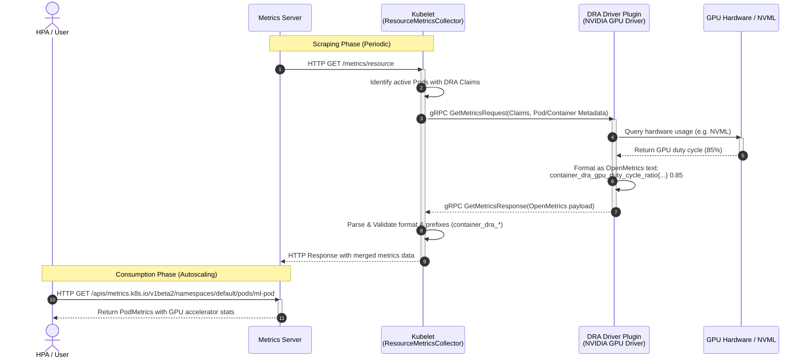

# KEP-6123: DRA Hardware Metrics Collection

<!-- toc -->
- [Release Signoff Checklist](#release-signoff-checklist)
- [Summary](#summary)
- [Motivation](#motivation)
  - [Why not the existing observability stack?](#why-not-the-existing-observability-stack)
  - [Goals](#goals)
  - [Non-Goals](#non-goals)
- [Proposal](#proposal)
  - [User Stories](#user-stories)
    - [Horizontal Pod Autoscaler (HPA) scaling on GPU utilization](#horizontal-pod-autoscaler-hpa-scaling-on-gpu-utilization)
    - [Multi-Metric HPA Scaling (Request Latency with Hardware Guardrails)](#multi-metric-hpa-scaling-request-latency-with-hardware-guardrails)
  - [Risks and Mitigations](#risks-and-mitigations)
- [Design Details](#design-details)
  - [DRA Plugin gRPC API Changes](#dra-plugin-grpc-api-changes)
  - [Kubelet Changes](#kubelet-changes)
    - [Capability Detection](#capability-detection)
    - [Scraping and Aggregation Flow](#scraping-and-aggregation-flow)
    - [Metrics Registration and Exposition](#metrics-registration-and-exposition)
  - [Standardized Metric Set](#standardized-metric-set)
    - [Allowed Metrics](#allowed-metrics)
    - [Required Labels](#required-labels)
  - [Metrics Server Changes](#metrics-server-changes)
    - [Scrape and Parsing Updates](#scrape-and-parsing-updates)
    - [Metrics API Extension (metrics.k8s.io/v1beta2)](#metrics-api-extension-metricsk8siov1beta2)
- [Graduation Criteria](#graduation-criteria)
  - [Alpha](#alpha)
  - [Beta](#beta)
  - [GA](#ga)
- [Production Readiness Review Questionnaire](#production-readiness-review-questionnaire)
  - [Feature Enablement and Rollback](#feature-enablement-and-rollback)
  - [Rollout, Upgrade and Rollback Planning](#rollout-upgrade-and-rollback-planning)
  - [Monitoring Requirements](#monitoring-requirements)
  - [Dependencies](#dependencies)
  - [Scalability](#scalability)
  - [Troubleshooting](#troubleshooting)
<!-- /toc -->

## Release Signoff Checklist

Items marked with (R) are required *prior to targeting to a milestone / release*.

- [ ] (R) KEP approvers have approved the KEP status as `implementable`
- [ ] (R) Design details are appropriately documented
- [ ] (R) Test plan is in place
- [ ] (R) Graduation criteria is in place
- [ ] (R) Production readiness review completed and approved

## Summary

This KEP closes a specific gap: Kubernetes has **no native, control-loop-consumable source of accelerator (GPU/TPU) utilization metrics**. Core components that already consume the `metrics.k8s.io` resource pipeline — most notably the Horizontal Pod Autoscaler (HPA) — can autoscale on CPU and memory out of the box, but cannot scale on GPU duty cycle or GPU memory without standing up a separate custom-metrics pipeline (Prometheus + Prometheus Adapter + `custom.metrics.k8s.io`).

This KEP proposes a standardized, hardware-agnostic mechanism using Dynamic Resource Allocation (DRA) to fill that gap. Local DRA resource drivers optionally expose a small set of hardware-agnostic accelerator metrics (duty cycle, memory working set/total) to Kubelet over a local gRPC service. Kubelet enriches them with Pod/Container/Claim metadata using in-memory state and exposes them at `/metrics/resource`. Metrics Server then serves them through `metrics.k8s.io/v1beta2`, making them directly consumable by HPA via the existing resource-metrics path — **no external adapter required**.

**This KEP is not an observability solution.** It is not a replacement for, and does not compete with, Prometheus, `dcgm-exporter`, or vendor telemetry stacks. Dashboards, alerting, and long-term/high-cardinality hardware telemetry remain the domain of those tools (see [Why not the existing observability stack?](#why-not-the-existing-observability-stack)).

## Motivation

With the growth of AI/ML workloads, accelerators like GPUs and TPUs have become critical cluster resources. Yet Kubelet and Metrics Server only collect CPU and memory, so the metrics that Kubernetes' own control loops can consume stop at CPU/memory. This is fine for human-facing observability — teams already run Prometheus and `dcgm-exporter` for that — but it leaves a concrete, unaddressed gap for **automated, in-cluster consumers**.

The primary problem this KEP solves:

**Native accelerator autoscaling requires a parallel metrics pipeline.** To scale a Deployment on GPU utilization today, an operator must deploy and operate Prometheus, `prometheus-adapter`, and wire up `custom.metrics.k8s.io` — purely to feed a number back into HPA that Kubelet is already positioned to know. This is a high barrier of entry for a first-class capability (autoscaling on the resource the workload actually bottlenecks on), and it duplicates a pipeline solely to bridge accelerator metrics into HPA.

Secondary problems that follow from serving accelerator metrics through the native path:
1. **Metadata correlation is high-privilege and error-prone.** Sidecar exporters must re-associate physical device metrics with Pod/Container identity by querying the Kubelet PodResources API or the API server under elevated privilege. Kubelet already holds this mapping in memory.
2. **No standard, vendor-neutral shape for autoscaling consumers.** HPA/scheduler consumers today couple to NVIDIA-specific `dcgm` metric names and layouts. A hardware-agnostic contract lets consumers target `nvidia.com/gpu_duty_cycle_ratio` or `google.com/tpu/...` uniformly.

Leveraging DRA — the standard, hardware-agnostic resource model in Kubernetes — we establish a native, local metrics path between Kubelet and DRA drivers that feeds the existing resource-metrics pipeline.

### Why not the existing observability stack?

The most common objection to this KEP is: *"Users already run Prometheus and `dcgm-exporter`, so this isn't needed."* That is true for observability, and this KEP deliberately does not overlap with it. The two serve different consumers:

| Concern | Prometheus + `dcgm-exporter` (existing) | This KEP (`metrics.k8s.io`) |
|---|---|---|
| Human dashboards, alerting, long-term storage | **Yes — the right tool.** Keep using it. | No. Explicit non-goal. |
| Rich/high-cardinality vendor metrics (temperature, ECC errors, NVLink, per-SM stats) | **Yes.** | No. Small hardware-agnostic set only. |
| Native HPA scaling on GPU/TPU utilization without a custom-metrics adapter | Requires Prometheus + `prometheus-adapter` + `custom.metrics.k8s.io` | **Yes — the core value.** Works through the pipeline HPA already uses. |
| Metadata correlation without high-privilege PodResources/API scraping | Sidecar must reconstruct identity | **Yes — Kubelet injects it from in-memory state.** |
| Vendor-neutral metric contract for control loops | Vendor-specific names | **Yes.** |

In short: if you only need dashboards and alerts, you do **not** need this KEP — keep your Prometheus stack. This KEP exists for clusters that want autoscaling and other core control loops to react to accelerator load **without** operating a second metrics pipeline just to bridge that data into HPA.

### Historical Context (Comparison with KEP-1867)

In Kubernetes v1.20 (via KEP-1867), built-in Kubelet `AcceleratorUsage` metrics were deprecated and subsequently removed. The primary drivers for that deprecation were:
1. **Vendor Coupling**: The old implementation was tightly coupled to NVIDIA GPUs, relying on hardcoded NVIDIA Management Library (NVML) bindings inside cAdvisor. This introduced vendor-specific dependencies into core Kubernetes components.
2. **Push for Out-of-Tree**: Sig-node introduced the PodResources API to offload metrics collection to third-party daemonsets (e.g., NVIDIA's `dcgm-exporter`), allowing vendors to customize and expose device metrics without changing Kubernetes core.

This proposal (**KEP-6123**) introduces a new collection path that overcomes the limitations of the old system while strictly adhering to the architectural principles of KEP-1867:

* **Strict Vendor Neutrality**: Kubelet does not compile, import, or invoke any vendor-specific libraries. The hardware-specific collection is done entirely out-of-tree inside the vendor's DRA driver. Kubelet only acts as a pass-through coordinator, calling a standardized, local gRPC socket (`DRAMetricsCollector`) and receiving generic, structured Protobuf metrics (`MetricFamily`).
* **Simplifying the Autoscaling Pipeline**: While the PodResources API works well for long-term telemetry dashboards, it creates a high barrier of entry for native autoscaling (HPA), which requires deploying Prometheus and a Custom Metrics adapter. Exposing basic, hardware-agnostic metrics natively via `/metrics/resource` and Metrics Server fills this critical gap for automated scheduling and scaling.
* **Unified Metadata Correlation**: By having Kubelet query the local driver directly, Kubernetes can automatically decorate hardware utilization metrics with Pod, Namespace, and Container metadata using in-memory local state, avoiding high-privilege out-of-tree API lookups.

### Goals

* Define a standard, optional gRPC metrics interface for local DRA plugins.
* Implement support in Kubelet to query registered DRA plugins for hardware-agnostic resource metrics.
* Expose these metrics securely at the `/metrics/resource` endpoint, decorated with Pod, Container, and ResourceClaim metadata.
* Extend Metrics Server to scrape, parse, and serve these hardware metrics through a new version of the Metrics API (`metrics.k8s.io/v1beta2`).

### Non-Goals

* **Replacing or competing with the observability stack.** This is not a substitute for Prometheus, `dcgm-exporter`, or vendor telemetry. Dashboards, alerting, and long-term metric storage remain out of scope and should continue to use those tools.
* **Serving as a general-purpose hardware telemetry bus.** The native path carries a small, hardware-agnostic set of autoscaling-relevant metrics. Rich or high-cardinality vendor metrics (e.g., CUDA core count, TPU optical link status, GPU temperature, ECC errors, per-SM stats) are explicitly out of scope for the Kubelet/Metrics Server APIs.
* Designing a metrics collection mechanism for out-of-tree or network-attached resources that bypass Kubelet.
* Re-implementing existing node-exporter or Prometheus scrape configs.

## Proposal

We propose the following metrics collection flow:

1. **DRA Plugin Registration**: The local DRA driver registers itself with Kubelet's plugin registration socket. In its list of supported gRPC services, it advertises the optional `k8s.io.kubelet.pkg.apis.dra.v1.DRAMetricsCollector` service capability.
2. **Metrics Request**: When a scrape client requests metrics from Kubelet's `/metrics/resource` endpoint, Kubelet's `ResourceMetricsCollector` initiates a localized gRPC call `GetMetrics` to all active DRA plugins supporting the capability.
3. **gRPC Payload**: Kubelet passes the list of active `ResourceClaim`s prepared by this driver on the node, along with their associated Pod metadata (`namespace`, `name`, `uid`) and Container names.
4. **Scraping**: The DRA plugin queries the underlying hardware API (e.g. NVML, ROCm, TPU runtime) for the requested devices, formats the metrics using the OpenMetrics standard, and tags them with the provided Pod/Container/Claim labels.
5. **Aggregation**: Kubelet collects the metrics payloads from all plugins, validates their structure, and merges them into the `/metrics/resource` HTTP response.
6. **Scrape by Metrics Server**: Metrics Server scrapes Kubelet's `/metrics/resource` endpoint, parses the accelerator metrics, and publishes them via the Metrics API (`metrics.k8s.io/v1beta2`).

### End-to-End Metrics Collection Flow



### User Stories

#### Horizontal Pod Autoscaler (HPA) scaling on GPU utilization
As an application developer running inference services, I want to use HPA to scale my deployment up or down based on the average GPU memory utilization or GPU duty cycle of my containers, querying these metrics natively via `metrics.k8s.io`.

#### Multi-Metric HPA Scaling (Request Latency with Hardware Guardrails)
As an AI Platform Engineer running large LLM serving containers (like vLLM), I want to scale my deployment primarily based on request queue depth (concurrency). However, I also want to configure secondary HPA metrics using native `container_dra` GPU utilization and memory metrics. This serves as a critical safety guardrail to scale up preemptively if:
- A user sends a batch of requests with extremely large context windows (high token count), which saturates the GPU's VRAM (KV Cache) and risks Out-of-Memory (OOM) pod crashes, even though the queue length itself is low.
- The GPU experiences thermal throttling, reducing compute performance and increasing response latency for existing requests.
By using native GPU memory and duty cycle metrics as safety backstops, I can ensure maximum service reliability and prevent container crashes.

### Risks and Mitigations

* **Impact on Kubelet Responsiveness (Node Health)**: Querying metrics over gRPC sockets synchronously during `/metrics/resource` HTTP scrapes is a major risk. If one or more DRA drivers block or hang, the Kubelet HTTP endpoint will timeout, which would block the collection of critical core CPU and Memory metrics for the entire node, causing the node to be marked `NotReady`.
  * *Mitigation*: **Asynchronous Scraping & Caching**. Kubelet's `ResourceMetricsCollector` will never query DRA drivers synchronously inside the HTTP handler. Instead, it will run a non-blocking background goroutine that periodically polls (e.g., every 15 seconds) registered DRA drivers and writes to an in-memory cache. The HTTP handler will serve instantly (sub-millisecond) from this cache. If a driver hangs, the background routine will timeout (e.g. 2 seconds) and leave the cached metrics stale or empty, without impacting core Kubelet performance.
* **Telemetry Cardinality Explosion (Cluster Health & Memory Safety)**: A misconfigured or buggy DRA driver could return thousands of metrics or excessive label pairs, causing Kubelet's memory footprint to balloon and potentially crashing downstream consumers like Metrics Server or Prometheus.
  * *Mitigation*: **Telemetry Guardrails**. Kubelet will enforce strict limits on the incoming Protobuf metrics:
    - Maximum of 50 metric families per ResourceClaim.
    - Maximum of 10 label pairs per metric.
    - Maximum length of 128 characters for metric names, label keys, and label values.
    Any metric exceeding these limits will be dropped immediately, and a scrape error metric (`dra_metrics_scrape_errors_total`) will be incremented.
* **Fault Isolation**: If a DRA driver crashes or its socket becomes unavailable, the failure must be contained.
  * *Mitigation*: Kubelet catches any gRPC network errors or connection failures. If a driver socket is dead, Kubelet simply marks its cache entry as stale and schedules a delayed retry, keeping all other drivers and Kubelet operations completely unaffected.

## Design Details

### DRA Plugin gRPC API Changes

We will introduce a new gRPC service `DRAMetricsCollector` in the staging Kubelet API package:
`kubernetes/staging/src/k8s.io/kubelet/pkg/apis/dra/v1/api.proto`

```protobuf
// DRAMetricsCollector is an optional service implemented by DRA resource drivers
// to expose hardware metrics to the Kubelet.
service DRAMetricsCollector {
  // GetMetrics returns hardware metrics for the specified ResourceClaims.
  rpc GetMetrics (GetMetricsRequest) returns (GetMetricsResponse) {}
}

message GetMetricsRequest {
  // List of pod claim requests.
  repeated PodClaimMetricsRequest requests = 1;
}

message PodClaimMetricsRequest {
  // Metadata of the pod using the claim.
  PodInfo pod = 1;
  
  // The claim to collect metrics for.
  Claim claim = 2;
  
  // The container names in the pod that consume this claim.
  repeated string container_names = 3;
}

message PodInfo {
  string namespace = 1;
  string name = 2;
  string uid = 3;
}

message GetMetricsResponse {
  // The metrics per ResourceClaim, keyed by claim_uid.
  map<string, ClaimMetricsResponse> claims = 1;
}

message ClaimMetricsResponse {
  // If non-empty, fetching metrics for the ResourceClaim failed.
  string error = 1;

  // The collected metrics. Only names in the standardized metric set are accepted;
  // any other names are dropped by Kubelet.
  // The driver must format the metrics with labels identifying the claim and devices,
  // utilizing the metadata provided in GetMetricsRequest.
  // Example payload:
  // container_dra_gpu_duty_cycle_ratio{namespace="default",pod="cuda-pod",container="cuda-container",claim_name="gpu-claim",claim_uid="...",device="gpu-0",driver="nvidia.com"} 0.85 1625841000000
  repeated MetricFamily metrics = 2;
}

message MetricFamily {
  string name = 1;
  string help = 2;
  MetricType type = 3;
  repeated Metric metrics = 4;
}

enum MetricType {
  GAUGE = 0;
  COUNTER = 1;
}

message Metric {
  // Label pairs for the metric.
  repeated LabelPair labels = 1;
  
  // The value of the metric.
  double value = 2;
  
  // Optional timestamp in milliseconds. If omitted, Kubelet's scrape time is used.
  int64 timestamp_ms = 3;
}

message LabelPair {
  string name = 1;
  string value = 2;
}
```

### Kubelet Changes

#### Capability Detection
During DRA plugin registration (handled by [DRAPluginManager](file:///usr/local/google/home/sizhang/Projects/k8s-core/kubernetes/pkg/kubelet/cm/dra/plugin/dra_plugin_manager.go)), Kubelet checks if `v1.DRAMetricsCollector` is present in the plugin's `supportedServices` slice.
If supported, Kubelet registers a gRPC client to query metrics.

#### Scraping and Aggregation Flow
Instead of querying plugins synchronously inside Kubelet's HTTP scrape endpoint handler, Kubelet will decouple the metric polling from metrics exposition to guarantee Kubelet responsiveness:

##### Background Polling Loop (Periodic)
A background goroutine in `ResourceMetricsCollector` runs periodically (e.g. every 15 seconds) to scrape and cache metrics from all active plugins:
1. **Active Pod Discovery**: Loops through active pods to discover assigned DRA `ResourceClaim`s.
2. **Group by Driver**: Groups these claims by their managing DRA driver.
3. **Query Plugins**: For each driver that supports `DRAMetricsCollector`, Kubelet creates a `GetMetricsRequest` and sends it to the driver's local socket with a short timeout (e.g. 2 seconds).
4. **Validate Against the Allowed Set**: Kubelet checks the returned `MetricFamily` slice against a fixed allowlist of metric names (see [Standardized Metric Set](#standardized-metric-set)), dropping any element that:
   - Is not a member of the allowed set.
   - Has the wrong metric type or unit for its name.
   - Exceeds cardinality guardrails (max 10 label pairs per metric; max 128 characters for metric names, label keys, and label values).
5. **Inject Metadata & Update Cache**: Kubelet resolves and injects missing or mismatched core metadata labels (`pod`, `namespace`, `container`, `driver`) using its local pod registry. The validated metrics are stored in a thread-safe local cache, keyed by Pod/Container/Claim.

##### HTTP Endpoint Serving (Scrape Time)
When a client queries Kubelet's `/metrics/resource` endpoint:
1. **Cache Read**: The `ResourceMetricsCollector` immediately reads from the thread-safe local cache (sub-millisecond operation).
2. **Exposition**: Kubelet translates the cached structured metrics into the OpenMetrics format and writes them directly to the HTTP response, alongside core CPU and Memory metrics. If a cache entry is missing or stale (older than 60 seconds), it is ignored, ensuring Kubelet never blocks.

#### Metrics Registration and Exposition
Metrics will be dynamically registered at scrape time within the collector's `CollectWithStability` method.
Descriptors (`metrics.Desc`) for standard metrics will be pre-defined in `resource_metrics.go` to ensure stability metrics categorization.

### Standardized Metric Set

Consistent with the Non-Goal of not being a general-purpose telemetry bus, Kubelet accepts only a **fixed, closed set** of hardware-agnostic accelerator metrics. Drivers may report a subset of these (reporting fewer is valid), but any metric name outside this set is dropped. This keeps the native path narrow, predictable for control-loop consumers, and free of vendor-specific surface. Rich or vendor-specific telemetry must continue to flow through Prometheus/`dcgm-exporter` (see [Why not the existing observability stack?](#why-not-the-existing-observability-stack)).

#### Allowed Metrics
All metrics are container-scoped and carry the `container_dra_` prefix (chosen to avoid collisions with core Kubelet, cAdvisor, and CRI metrics). `<resource>` is a driver-declared resource class token (e.g. `gpu`, `tpu`).

| Metric Name | Type | Unit | Description |
|---|---|---|---|
| `container_dra_<resource>_duty_cycle_ratio` | Gauge | Ratio (0.0-1.0) | Active compute utilization duty cycle. |
| `container_dra_<resource>_memory_working_set_bytes` | Gauge | Bytes | Active accelerator memory in use. |
| `container_dra_<resource>_memory_total_bytes` | Gauge | Bytes | Total accelerator memory available to the container. |

Kubelet validates that each reported metric matches the expected type and unit for its name. Metrics failing validation are dropped and counted in `dra_metrics_scrape_errors_total`. Adding new metrics to this set is an API change that must go through a KEP update and Metrics API review; it is intentionally not extensible by drivers at runtime.

#### Required Labels
For Kubelet to accept and expose container-scoped metrics, the driver must label them using the metadata supplied in the `GetMetricsRequest`:
- `namespace`: Pod namespace.
- `pod`: Pod name.
- `container`: Container name.
- `driver`: The DRA driver name (e.g. `nvidia.com`, `google.com/tpu`).
- `claim_name`: The DRA ResourceClaim name.
- `claim_uid`: The DRA ResourceClaim UID.
- `device`: Driver-defined physical or virtual device ID (e.g. `gpu-0`).

### Metrics Server Changes

Metrics Server represents accelerator metrics using the `ResourceList` type, populated only with keys derived from the fixed [Standardized Metric Set](#standardized-metric-set).

#### Scrape and Parsing Updates
Metrics Server's client ([client.go](file:///usr/local/google/home/sizhang/Projects/k8s-core/metrics-server/pkg/scraper/client/resource/client.go)) will scrape `/metrics/resource` as usual.
The parser in [decode.go](file:///usr/local/google/home/sizhang/Projects/k8s-core/metrics-server/pkg/scraper/client/resource/decode.go) will match metrics carrying the `container_dra_` prefix against the standardized set, convert the suffix into a resource key under the accelerator's `Usage` map (e.g. `nvidia.com/gpu_duty_cycle_ratio`), and serialize the values as standard K8s `Quantity` types. Metrics not in the standardized set are ignored.

#### Metrics API Extension (metrics.k8s.io/v1beta2)
We propose extending the metrics schema in Metrics Server to support a new API version `metrics.k8s.io/v1beta2`.

```go
type PodMetrics struct {
    metav1.TypeMeta
    metav1.ObjectMeta
    Timestamp  metav1.Time
    Window     metav1.Duration
    Containers []ContainerMetrics
}

type ContainerMetrics struct {
    Name  string
    Usage ResourceList // CPU and Memory
    
    // Allocator metrics assigned to the container via DRA.
    // +optional
    Accelerators []AcceleratorMetrics
}

type AcceleratorMetrics struct {
    // Unique device identifier (e.g., gpu-0)
    Device string
    
    // Managing DRA driver name (e.g., nvidia.com)
    Driver string
    
    // Dynamically populated map of resource metrics returned by the DRA driver
    Usage ResourceList
}
```
If a pod uses multiple devices of different resource classes, Metrics Server aggregates the stats for each device separately.

#### Metrics Mapping to ResourceList
Metrics Server maps the fixed [Standardized Metric Set](#standardized-metric-set) into `ResourceList` keys using the following rules:

1. **Key Generation**: A metric named `container_dra_<metric_suffix>` from driver `<driver_name>` is exposed under `Usage` with the key `<driver_name>/<metric_suffix>`.
   - E.g., `container_dra_gpu_duty_cycle_ratio` from driver `nvidia.com` maps to `nvidia.com/gpu_duty_cycle_ratio`.
   - E.g., `container_dra_tpu_memory_working_set_bytes` from driver `google.com/tpu` maps to `google.com/tpu/tpu_memory_working_set_bytes`.
2. **Value Representation**: Since `ResourceList` values must be of type `Quantity`, ratio metrics are represented using standard milli-units (e.g., `0.85` becomes `850m`). Byte metrics are represented directly as standard quantities.

Because the metric set is fixed, the set of possible `Usage` keys is bounded and known ahead of time; Metrics Server does not ingest arbitrary driver-defined keys.

#### Autoscaling with HPA

This mapping enables the Horizontal Pod Autoscaler (HPA) to scale on the standardized accelerator metrics natively through the resource metrics pipeline, without requiring an external metrics adapter (e.g. Prometheus Adapter) or modifications to the HPA controller.

##### HPA Resource Metric Target Example
Below is an HPA configuration scaling based on the dynamic GPU duty cycle metric of a container:

```yaml
apiVersion: autoscaling/v2
kind: HorizontalPodAutoscaler
metadata:
  name: ml-inference-scaler
  namespace: default
spec:
  scaleTargetRef:
    apiVersion: apps/v1
    kind: Deployment
    name: ml-inference-deployment
  minReplicas: 1
  maxReplicas: 10
  metrics:
  - type: ContainerResource
    containerResource:
      container: cuda-container
      name: nvidia.com/gpu_duty_cycle_ratio  # Dynamic metric key from the DRA driver
      target:
        type: AverageValue
        averageValue: 800m  # Scale when average GPU utilization exceeds 80% (800 milli-units)
```

##### HPA Controller Mechanics & Compatibility
This integration functions out of the box because of the following core design details:

1. **String-Based Resource Checking**: The Kubernetes HPA controller evaluates resource metrics by matching a generic string type (`v1.ResourceName` is defined as `type ResourceName string`). When the controller retrieves metric values via the resource client, it looks up the key in the container's `Usage` map:
   ```go
   // From: kubernetes/pkg/controller/podautoscaler/metrics/client.go
   if val, resFound := c.Usage[resource]; resFound {
       // val contains the matched Quantity
   }
   ```
   Because Metrics Server dynamically populates `Usage` with keys like `nvidia.com/gpu_duty_cycle_ratio`, the lookup succeeds automatically.

2. **Scaling on AverageValue (Raw Values)**: 
   Containers request the resource device itself (e.g., `nvidia.com/gpu: 1`), not the metric namespace (e.g., `nvidia.com/gpu_duty_cycle_ratio`).
   - If an HPA targets `AverageUtilization`, the HPA controller validates that the pod spec declares a matching request limit (`c.Resources.Requests[resource]`), returning an error if it is missing.
   - To bypass this, autoscaling on dynamic metrics must target `AverageValue`. The HPA controller then calculates desired replicas via `GetRawResourceReplicas`, which skips requests parsing and directly calculates:
     $$\text{desiredReplicas} = \text{ceil} \left( \text{currentReplicas} \times \frac{\text{actualUsage}}{\text{targetUsage}} \right)$$
     This makes it fully compatible with custom metric formats.

## Graduation Criteria

### Alpha

* Feature gate `DRAHardwareMetrics` implemented in Kubelet (default off).
* Define the `DRAMetricsCollector` gRPC service interface.
* Implement DRA plugin scraping in Kubelet's `/metrics/resource` endpoint.
* Write unit and integration tests for Kubelet DRA metrics scraping.

### Beta

* Enable `DRAHardwareMetrics` by default.
* Implement `metrics.k8s.io/v1beta2` in Metrics Server.
* Integrate with at least two out-of-tree DRA drivers (e.g. NVIDIA GPU DRA driver and Google TPU DRA driver) to validate integration.
* Gather feedback on HPA scaling stability with accelerator metrics.

### GA

* Lock `DRAHardwareMetrics` to on.
* Graduate `metrics.k8s.io/v1beta2` to `metrics.k8s.io/v1` or finalize `v1beta2` stability.
* Implement conformance tests for node-local metrics scraping.

## Production Readiness Review Questionnaire

### Feature Enablement and Rollback

* **How can this feature be enabled / disabled?**
  Controlled by the `DRAHardwareMetrics` feature gate on Kubelet.
* **Can the feature be disabled after enablement without restarting?**
  No, Kubelet must be restarted to apply feature gate changes.
* **What are the side effects of disabling the feature?**
  If disabled, `/metrics/resource` will revert to only serving CPU, memory, and swap metrics. DRA plugins will not be queried.

### Rollout, Upgrade and Rollback Planning

* **Is there any skew supported between Kubelet and DRA drivers?**
  Yes. If the DRA driver does not support `DRAMetricsCollector` or is an older version, Kubelet will simply skip metrics scraping for that driver's claims.
* **How is rollback handled if metrics collection causes crashes?**
  Disabling the feature gate will prevent all Kubelet code paths from reaching out to the DRA metrics sockets.

### Monitoring Requirements

* **What metrics can be used to monitor the health of this feature?**
  - `dra_metrics_scrape_duration_seconds`: Histogram of how long gRPC calls to DRA plugins take.
  - `dra_metrics_scrape_errors_total`: Counter of failed metrics scrapes (e.g. gRPC errors, parsing errors, invalid schemas).

### Dependencies

* **Does this feature depend on any other features?**
  Yes, it depends on Dynamic Resource Allocation (`DynamicResourceAllocation` feature gate) to discover claims and drivers.

### Scalability

* **Will this feature increase the CPU/Memory utilization of Kubelet?**
  Minimal increase. The scraping happens on demand (default every 15-60 seconds when scraped by Metrics Server). The gRPC calls are node-local. Parsing overhead is restricted to a small number of metrics.
* **Will it increase API server load?**
  No, metrics are served locally from Kubelet to Metrics Server and do not involve apiserver read/writes.

### Troubleshooting

* **How can a user debug if metrics are missing?**
  1. Check if the DRA driver pod is running and registers the socket.
  2. Verify that Kubelet logs contain "Registered DRA plugin with metrics collection capability".
  3. Query Kubelet's `/metrics/resource` endpoint directly on the node to check if the `container_dra_*` metrics are populated.
