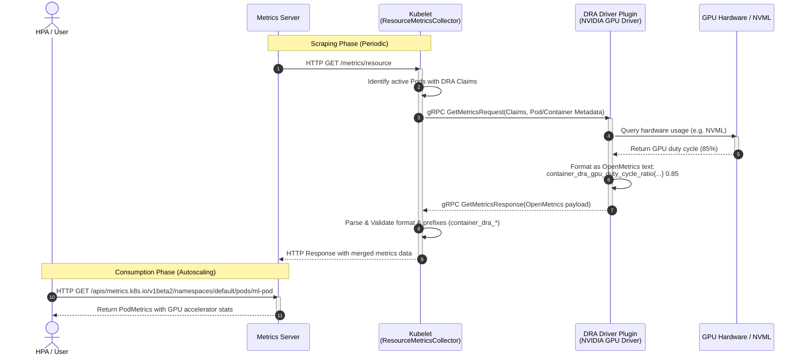

# KEP-6123: DRA Hardware Metrics Collection

<!-- toc -->
- [Release Signoff Checklist](#release-signoff-checklist)
- [Summary](#summary)
- [Motivation](#motivation)
  - [Goals](#goals)
  - [Non-Goals](#non-goals)
- [Proposal](#proposal)
  - [User Stories](#user-stories)
    - [Kubernetes AI Operator monitoring GPU/TPU utilization](#kubernetes-ai-operator-monitoring-gputpu-utilization)
    - [Horizontal Pod Autoscaler (HPA) scaling on GPU utilization](#horizontal-pod-autoscaler-hpa-scaling-on-gpu-utilization)
  - [Risks and Mitigations](#risks-and-mitigations)
- [Design Details](#design-details)
  - [DRA Plugin gRPC API Changes](#dra-plugin-grpc-api-changes)
  - [Kubelet Changes](#kubelet-changes)
    - [Capability Detection](#capability-detection)
    - [Scraping and Aggregation Flow](#scraping-and-aggregation-flow)
    - [Metrics Registration and Exposition](#metrics-registration-and-exposition)
  - [Standardized Metrics Format](#standardized-metrics-format)
    - [Metric Definitions](#metric-definitions)
    - [Labels](#labels)
  - [Metrics Server Changes](#metrics-server-changes)
    - [Scrape and Parsing Updates](#scrape-and-parsing-updates)
    - [Metrics API Extension (metrics.k8s.io/v1beta2)](#metrics-api-extension-metricsk8siov1beta2)
- [Graduation Criteria](#graduation-criteria)
  - [Alpha](#alpha)
  - [Beta](#beta)
  - [GA](#ga)
- [Production Readiness Review Questionnaire](#production-readiness-review-questionnaire)
  - [Feature Enablement and Rollback](#feature-enablement-and-rollback)
  - [Rollout, Upgrade and Rollback Planning](#rollout-upgrade-and-rollback-planning)
  - [Monitoring Requirements](#monitoring-requirements)
  - [Dependencies](#dependencies)
  - [Scalability](#scalability)
  - [Troubleshooting](#troubleshooting)
<!-- /toc -->

## Release Signoff Checklist

Items marked with (R) are required *prior to targeting to a milestone / release*.

- [ ] (R) KEP approvers have approved the KEP status as `implementable`
- [ ] (R) Design details are appropriately documented
- [ ] (R) Test plan is in place
- [ ] (R) Graduation criteria is in place
- [ ] (R) Production readiness review completed and approved

## Summary

This KEP proposes a standardized, hardware-agnostic metrics collection mechanism for Kubernetes using Dynamic Resource Allocation (DRA). The mechanism enables local DRA resource drivers to expose hardware utilization metrics (such as GPU/TPU active duty cycle, memory usage, etc.) to Kubelet. Kubelet aggregates these metrics, enriches them with pod and container metadata, and exposes them at the `/metrics/resource` endpoint. Metrics Server then scrapes Kubelet to gather and serve these accelerator metrics to Kubernetes autoscaling and scheduling components (e.g. HPA).

## Motivation

With the exponential growth of AI/ML workloads, accelerators like GPUs and TPUs have become critical components of Kubernetes clusters. However, Kubelet and Metrics Server currently only collect and expose CPU and memory metrics. 

To collect hardware metrics like GPU/TPU utilization, users are forced to install and manage third-party sidecars and agents (such as NVIDIA's `dcgm-exporter` or custom TPU exporters). This setup introduces several problems:
1. **Operational Complexity**: Managing separate daemonsets, service monitors, and configs for every hardware class.
2. **Namespace/Metadata Attributing**: Re-associating physical device metrics with Pod and Container namespaces/names is complex, error-prone, and requires scraping agents to query the Kubelet PodResources API or K8s API server under high privilege.
3. **Autoscaling Fragmentation**: Standard autoscalers like the Horizontal Pod Autoscaler (HPA) cannot easily scale on accelerator metrics without deploying additional pipelines (e.g., Prometheus, Prometheus Adapter, Custom Metrics APIs).

Leveraging DRA (Dynamic Resource Allocation), the standard and hardware-agnostic model for resource management in Kubernetes, we can establish a native, local metrics-scraping path between Kubelet and DRA drivers.

### Goals

* Define a standard, optional gRPC metrics interface for local DRA plugins.
* Implement support in Kubelet to query registered DRA plugins for hardware-agnostic resource metrics.
* Expose these metrics securely at the `/metrics/resource` endpoint, decorated with Pod, Container, and ResourceClaim metadata.
* Extend Metrics Server to scrape, parse, and serve these hardware metrics through a new version of the Metrics API (`metrics.k8s.io/v1beta2`).

### Non-Goals

* Defining vendor-specific hardware metrics (e.g., CUDA core count, TPU optical link status, GPU temperature) in Kubelet or Metrics Server APIs.
* Designing a metrics collection mechanism for out-of-tree or network-attached resources that bypass Kubelet.
* Re-implementing existing node-exporter or Prometheus scrape configs.

## Proposal

We propose the following metrics collection flow:

1. **DRA Plugin Registration**: The local DRA driver registers itself with Kubelet's plugin registration socket. In its list of supported gRPC services, it advertises the optional `k8s.io.kubelet.pkg.apis.dra.v1.DRAMetricsCollector` service capability.
2. **Metrics Request**: When a scrape client requests metrics from Kubelet's `/metrics/resource` endpoint, Kubelet's `ResourceMetricsCollector` initiates a localized gRPC call `GetMetrics` to all active DRA plugins supporting the capability.
3. **gRPC Payload**: Kubelet passes the list of active `ResourceClaim`s prepared by this driver on the node, along with their associated Pod metadata (`namespace`, `name`, `uid`) and Container names.
4. **Scraping**: The DRA plugin queries the underlying hardware API (e.g. NVML, ROCm, TPU runtime) for the requested devices, formats the metrics using the OpenMetrics standard, and tags them with the provided Pod/Container/Claim labels.
5. **Aggregation**: Kubelet collects the metrics payloads from all plugins, validates their structure, and merges them into the `/metrics/resource` HTTP response.
6. **Scrape by Metrics Server**: Metrics Server scrapes Kubelet's `/metrics/resource` endpoint, parses the accelerator metrics, and publishes them via the Metrics API (`metrics.k8s.io/v1beta2`).

### End-to-End Metrics Collection Flow



### User Stories

#### Kubernetes AI Operator monitoring GPU/TPU utilization
As a cluster administrator running ML training jobs, I want to view my GPU and TPU utilization metrics natively without deploying separate dcgm-exporters or custom daemonsets. I want these metrics to be pre-associated with the exact Pod and Container that own the DRA `ResourceClaim`.

#### Horizontal Pod Autoscaler (HPA) scaling on GPU utilization
As an application developer running inference services, I want to use HPA to scale my deployment up or down based on the average GPU memory utilization or GPU duty cycle of my containers, querying these metrics natively via `metrics.k8s.io`.

### Risks and Mitigations

* **Performance Impact on Kubelet**: Scraping metrics dynamically from gRPC plugins during `/metrics/resource` requests could introduce latency or block Kubelet if a driver hangs.
  * *Mitigation*: Kubelet will invoke plugin gRPC calls with a strict, short timeout (e.g., 2 seconds). Kubelet can also perform passive caching, serving cached metrics if the plugin takes too long or fails.
* **Malicious/Buggy Driver Payload**: An invalid OpenMetrics payload from a DRA driver could corrupt the Kubelet `/metrics/resource` output, breaking metrics-server scraping for the entire node.
  * *Mitigation*: Kubelet will parse and validate the OpenMetrics output from the plugin before appending it. Kubelet will enforce a name prefix constraint (e.g., metric names must start with `container_dra_` or `node_dra_`) to prevent collisions with core K8s metrics, but will not restrict the names to a hardcoded list. If a plugin returns invalid metrics, Kubelet will drop that plugin's payload, log an error, and increment a `dra_metrics_scrape_error` metric, keeping the rest of the endpoint functioning.

## Design Details

### DRA Plugin gRPC API Changes

We will introduce a new gRPC service `DRAMetricsCollector` in the staging Kubelet API package:
`kubernetes/staging/src/k8s.io/kubelet/pkg/apis/dra/v1/api.proto`

```protobuf
// DRAMetricsCollector is an optional service implemented by DRA resource drivers
// to expose hardware metrics to the Kubelet.
service DRAMetricsCollector {
  // GetMetrics returns hardware metrics for the specified ResourceClaims.
  rpc GetMetrics (GetMetricsRequest) returns (GetMetricsResponse) {}
}

message GetMetricsRequest {
  // List of pod claim requests.
  repeated PodClaimMetricsRequest requests = 1;
}

message PodClaimMetricsRequest {
  // Metadata of the pod using the claim.
  PodInfo pod = 1;
  
  // The claim to collect metrics for.
  Claim claim = 2;
  
  // The container names in the pod that consume this claim.
  repeated string container_names = 3;
}

message PodInfo {
  string namespace = 1;
  string name = 2;
  string uid = 3;
}

message GetMetricsResponse {
  // The metrics per ResourceClaim, keyed by claim_uid.
  map<string, ClaimMetricsResponse> claims = 1;
}

message ClaimMetricsResponse {
  // If non-empty, fetching metrics for the ResourceClaim failed.
  string error = 1;

  // The collected metrics, formatted as OpenMetrics exposition text format.
  // The driver must format the metrics with labels identifying the claim and devices,
  // utilizing the metadata provided in GetMetricsRequest.
  // Example payload:
  // container_dra_gpu_duty_cycle_ratio{namespace="default",pod="cuda-pod",container="cuda-container",claim_name="gpu-claim",claim_uid="...",device="gpu-0",driver="nvidia.com"} 0.85 1625841000000
  bytes metrics_data = 2;
}
```

### Kubelet Changes

#### Capability Detection
During DRA plugin registration (handled by [DRAPluginManager](file:///usr/local/google/home/sizhang/Projects/k8s-core/kubernetes/pkg/kubelet/cm/dra/plugin/dra_plugin_manager.go)), Kubelet checks if `v1.DRAMetricsCollector` is present in the plugin's `supportedServices` slice.
If supported, Kubelet registers a gRPC client to query metrics.

#### Scraping and Aggregation Flow
We will extend the `resourceMetricsCollector` in [resource_metrics.go](file:///usr/local/google/home/sizhang/Projects/k8s-core/kubernetes/pkg/kubelet/metrics/collectors/resource_metrics.go):

1. **Active Pod Discovery**: Loop through active pods and check for allocated DRA claims.
2. **Group by Driver**: Group `ResourceClaim` allocations by their managing DRA driver name.
3. **Query Plugins**: For each driver that supports `DRAMetricsCollector`, Kubelet creates a `GetMetricsRequest` with the active claims, pod metadata, and container mapping.
4. **Parse and Validate**: Parse the returned `metrics_data` bytes using `github.com/prometheus/prometheus/model/textparse` to verify the format, ensuring:
   - Metric names conform to the prefix constraint: must start with `container_dra_` or `node_dra_` (for node-level metrics). This prevents the driver from spoofing or colliding with core Kubelet/CRI metrics.
   - Required labels (`pod`, `namespace`, `container` [for container metrics], `driver`) match the request context.
5. **Serve**: Expose the verified metrics inside Kubelet's `/metrics/resource` output.

#### Metrics Registration and Exposition
Metrics will be dynamically registered at scrape time within the collector's `CollectWithStability` method.
Descriptors (`metrics.Desc`) for standard metrics will be pre-defined in `resource_metrics.go` to ensure stability metrics categorization.

### OpenMetrics Format & Naming Conventions

Rather than enforcing a strict whitelist of allowed metric names, Kubelet allows DRA drivers to publish arbitrary metrics, provided they adhere to the OpenMetrics standard and the naming conventions below.

#### Prefix Constraints
To prevent metric name collisions with core Kubelet, cAdvisor, and CRI metrics, Kubelet will filter out any metrics that do not carry one of the following prefixes:
*   `container_dra_`: For container-scoped metrics (requires `pod`, `namespace`, and `container` labels).
*   `node_dra_`: For node-scoped metrics (does not require pod/container labels).

#### Recommended Metric Conventions
To ensure compatibility and consistency across different hardware vendors, driver developers are highly encouraged to map their core resource metrics to the following conventions:

| Convention Metric Name | Type | Unit | Description |
|---|---|---|---|
| `container_dra_<resource>_duty_cycle_ratio` | Gauge | Ratio (0.0-1.0) | Active utilization duty cycle (e.g. `container_dra_gpu_duty_cycle_ratio`). |
| `container_dra_<resource>_memory_working_set_bytes` | Gauge | Bytes | Active memory usage (e.g. `container_dra_gpu_memory_working_set_bytes`). |
| `container_dra_<resource>_memory_total_bytes` | Gauge | Bytes | Total available memory (e.g. `container_dra_gpu_memory_total_bytes`). |

#### Required Labels
For Kubelet to accept and expose container-scoped metrics, the driver must label them using the metadata supplied in the `GetMetricsRequest`:
- `namespace`: Pod namespace.
- `pod`: Pod name.
- `container`: Container name.
- `driver`: The DRA driver name (e.g. `nvidia.com`, `google.com/tpu`).
- `claim_name`: The DRA ResourceClaim name.
- `claim_uid`: The DRA ResourceClaim UID.
- `device`: Driver-defined physical or virtual device ID (e.g. `gpu-0`).

### Metrics Server Changes

Because Metrics Server implements the structured Metrics API (`metrics.k8s.io`), it cannot dynamically expose arbitrary metrics via its standard endpoint.

#### Scrape and Parsing Updates
Metrics Server's client ([client.go](file:///usr/local/google/home/sizhang/Projects/k8s-core/metrics-server/pkg/scraper/client/resource/client.go)) will scrape `/metrics/resource` as usual.
The parser in [decode.go](file:///usr/local/google/home/sizhang/Projects/k8s-core/metrics-server/pkg/scraper/client/resource/decode.go) will scan for metrics conforming to the recommended conventions (matching the patterns `container_dra_*_duty_cycle_ratio` and `container_dra_*_memory_*`).
Other arbitrary metrics (e.g., temperature, error rates, custom vendor indicators) will be ignored by Metrics Server, but will remain available to full-fledged monitoring solutions (like Prometheus/Grafana) that scrape Kubelet directly.

#### Metrics API Extension (metrics.k8s.io/v1beta2)
We propose extending the metrics schema in Metrics Server to support a new API version `metrics.k8s.io/v1beta2`.

```go
type PodMetrics struct {
    metav1.TypeMeta
    metav1.ObjectMeta
    Timestamp  metav1.Time
    Window     metav1.Duration
    Containers []ContainerMetrics
}

type ContainerMetrics struct {
    Name  string
    Usage ResourceList // CPU and Memory
    
    // Allocator metrics assigned to the container via DRA.
    // +optional
    Accelerators []AcceleratorMetrics
}

type AcceleratorMetrics struct {
    // Unique device identifier
    Device string
    
    // Managing DRA driver name
    Driver string
    
    // Standard hardware metrics mapped by the parser
    Usage ResourceList // duty-cycle, memory-working-set, memory-total
}
```
If a pod uses multiple devices of different resource classes, Metrics Server aggregates the stats for each device separately.

For advanced autoscaling using arbitrary metrics (e.g., scaling based on custom queue depths exposed by a custom accelerator), users should deploy Prometheus Adapter to feed those metrics from Prometheus to the Kubernetes Custom Metrics API (`custom.metrics.k8s.io`).

## Graduation Criteria

### Alpha

* Feature gate `DRAHardwareMetrics` implemented in Kubelet (default off).
* Define the `DRAMetricsCollector` gRPC service interface.
* Implement DRA plugin scraping in Kubelet's `/metrics/resource` endpoint.
* Write unit and integration tests for Kubelet DRA metrics scraping.

### Beta

* Enable `DRAHardwareMetrics` by default.
* Implement `metrics.k8s.io/v1beta2` in Metrics Server.
* Integrate with at least two out-of-tree DRA drivers (e.g. NVIDIA GPU DRA driver and Google TPU DRA driver) to validate integration.
* Gather feedback on HPA scaling stability with accelerator metrics.

### GA

* Lock `DRAHardwareMetrics` to on.
* Graduate `metrics.k8s.io/v1beta2` to `metrics.k8s.io/v1` or finalize `v1beta2` stability.
* Implement conformance tests for node-local metrics scraping.

## Production Readiness Review Questionnaire

### Feature Enablement and Rollback

* **How can this feature be enabled / disabled?**
  Controlled by the `DRAHardwareMetrics` feature gate on Kubelet.
* **Can the feature be disabled after enablement without restarting?**
  No, Kubelet must be restarted to apply feature gate changes.
* **What are the side effects of disabling the feature?**
  If disabled, `/metrics/resource` will revert to only serving CPU, memory, and swap metrics. DRA plugins will not be queried.

### Rollout, Upgrade and Rollback Planning

* **Is there any skew supported between Kubelet and DRA drivers?**
  Yes. If the DRA driver does not support `DRAMetricsCollector` or is an older version, Kubelet will simply skip metrics scraping for that driver's claims.
* **How is rollback handled if metrics collection causes crashes?**
  Disabling the feature gate will prevent all Kubelet code paths from reaching out to the DRA metrics sockets.

### Monitoring Requirements

* **What metrics can be used to monitor the health of this feature?**
  - `dra_metrics_scrape_duration_seconds`: Histogram of how long gRPC calls to DRA plugins take.
  - `dra_metrics_scrape_errors_total`: Counter of failed metrics scrapes (e.g. gRPC errors, parsing errors, invalid schemas).

### Dependencies

* **Does this feature depend on any other features?**
  Yes, it depends on Dynamic Resource Allocation (`DynamicResourceAllocation` feature gate) to discover claims and drivers.

### Scalability

* **Will this feature increase the CPU/Memory utilization of Kubelet?**
  Minimal increase. The scraping happens on demand (default every 15-60 seconds when scraped by Metrics Server). The gRPC calls are node-local. Parsing overhead is restricted to a small number of metrics.
* **Will it increase API server load?**
  No, metrics are served locally from Kubelet to Metrics Server and do not involve apiserver read/writes.

### Troubleshooting

* **How can a user debug if metrics are missing?**
  1. Check if the DRA driver pod is running and registers the socket.
  2. Verify that Kubelet logs contain "Registered DRA plugin with metrics collection capability".
  3. Query Kubelet's `/metrics/resource` endpoint directly on the node to check if the `container_accelerator_*` metrics are populated.
