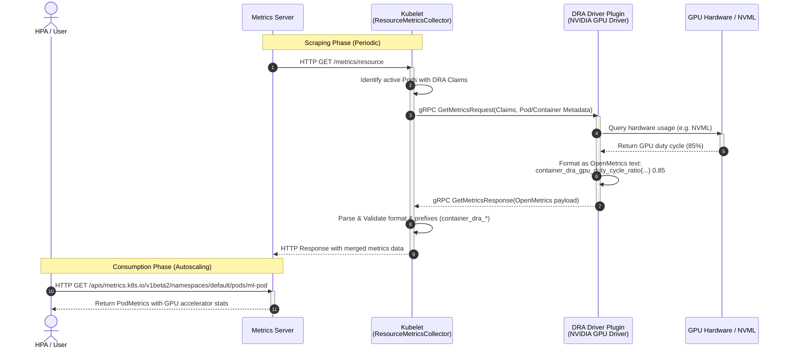

# KEP-6123: DRA Hardware Metrics Collection

<!-- toc -->
- [Release Signoff Checklist](#release-signoff-checklist)
- [Summary](#summary)
- [Motivation](#motivation)
  - [Goals](#goals)
  - [Non-Goals](#non-goals)
- [Proposal](#proposal)
  - [User Stories](#user-stories)
    - [Kubernetes AI Operator monitoring GPU/TPU utilization](#kubernetes-ai-operator-monitoring-gputpu-utilization)
    - [Horizontal Pod Autoscaler (HPA) scaling on GPU utilization](#horizontal-pod-autoscaler-hpa-scaling-on-gpu-utilization)
  - [Risks and Mitigations](#risks-and-mitigations)
- [Design Details](#design-details)
  - [DRA Plugin gRPC API Changes](#dra-plugin-grpc-api-changes)
  - [Kubelet Changes](#kubelet-changes)
    - [Capability Detection](#capability-detection)
    - [Scraping and Aggregation Flow](#scraping-and-aggregation-flow)
    - [Metrics Registration and Exposition](#metrics-registration-and-exposition)
  - [Standardized Metrics Format](#standardized-metrics-format)
    - [Metric Definitions](#metric-definitions)
    - [Labels](#labels)
  - [Metrics Server Changes](#metrics-server-changes)
    - [Scrape and Parsing Updates](#scrape-and-parsing-updates)
    - [Metrics API Extension (metrics.k8s.io/v1beta2)](#metrics-api-extension-metricsk8siov1beta2)
- [Graduation Criteria](#graduation-criteria)
  - [Alpha](#alpha)
  - [Beta](#beta)
  - [GA](#ga)
- [Production Readiness Review Questionnaire](#production-readiness-review-questionnaire)
  - [Feature Enablement and Rollback](#feature-enablement-and-rollback)
  - [Rollout, Upgrade and Rollback Planning](#rollout-upgrade-and-rollback-planning)
  - [Monitoring Requirements](#monitoring-requirements)
  - [Dependencies](#dependencies)
  - [Scalability](#scalability)
  - [Troubleshooting](#troubleshooting)
<!-- /toc -->

## Release Signoff Checklist

Items marked with (R) are required *prior to targeting to a milestone / release*.

- [ ] (R) KEP approvers have approved the KEP status as `implementable`
- [ ] (R) Design details are appropriately documented
- [ ] (R) Test plan is in place
- [ ] (R) Graduation criteria is in place
- [ ] (R) Production readiness review completed and approved

## Summary

This KEP proposes a standardized, hardware-agnostic metrics collection mechanism for Kubernetes using Dynamic Resource Allocation (DRA). The mechanism enables local DRA resource drivers to expose hardware utilization metrics (such as GPU/TPU active duty cycle, memory usage, etc.) to Kubelet. Kubelet aggregates these metrics, enriches them with pod and container metadata, and exposes them at the `/metrics/resource` endpoint. Metrics Server then scrapes Kubelet to gather and serve these accelerator metrics to Kubernetes autoscaling and scheduling components (e.g. HPA).

## Motivation

With the exponential growth of AI/ML workloads, accelerators like GPUs and TPUs have become critical components of Kubernetes clusters. However, Kubelet and Metrics Server currently only collect and expose CPU and memory metrics. 

To collect hardware metrics like GPU/TPU utilization, users are forced to install and manage third-party sidecars and agents (such as NVIDIA's `dcgm-exporter` or custom TPU exporters). This setup introduces several problems:
1. **Operational Complexity**: Managing separate daemonsets, service monitors, and configs for every hardware class.
2. **Namespace/Metadata Attributing**: Re-associating physical device metrics with Pod and Container namespaces/names is complex, error-prone, and requires scraping agents to query the Kubelet PodResources API or K8s API server under high privilege.
3. **Autoscaling Fragmentation**: Standard autoscalers like the Horizontal Pod Autoscaler (HPA) cannot easily scale on accelerator metrics without deploying additional pipelines (e.g., Prometheus, Prometheus Adapter, Custom Metrics APIs).
4. **Lack of Cluster Health & Reliability Visibility**: Core Kubernetes scheduling and node-management controllers are completely blind to accelerator health. 
   - **Silent Hardware Degradation**: Thermal throttling or hardware/bus errors can cause a GPU/TPU to run extremely slowly without crashing the container, wasting expensive resources.
   - **Shared-Resource GPU OOMs**: Unlike CPU which throttles under load, GPU memory exhaustion causes immediate container crashes (OOMs). When multiple containers share a partitioned GPU, memory usage spikes can cause cascading pod failures.
   - **"Zombie" Allocations**: A container's code can deadlock (e.g., in ML data loaders) while holding a GPU allocation, resulting in 0% utilization for hours while blocking other workloads from scheduling.

Exposing native accelerator utilization and memory metrics allows automation tooling to detect these scenarios, quarantine unhealthy nodes, and evict deadlocked workloads, greatly improving cluster reliability.

Leveraging DRA (Dynamic Resource Allocation), the standard and hardware-agnostic model for resource management in Kubernetes, we can establish a native, local metrics-scraping path between Kubelet and DRA drivers.

### Historical Context (Comparison with KEP-1867)

In Kubernetes v1.20 (via KEP-1867), built-in Kubelet `AcceleratorUsage` metrics were deprecated and subsequently removed. The primary drivers for that deprecation were:
1. **Vendor Coupling**: The old implementation was tightly coupled to NVIDIA GPUs, relying on hardcoded NVIDIA Management Library (NVML) bindings inside cAdvisor. This introduced vendor-specific dependencies into core Kubernetes components.
2. **Push for Out-of-Tree**: Sig-node introduced the PodResources API to offload metrics collection to third-party daemonsets (e.g., NVIDIA's `dcgm-exporter`), allowing vendors to customize and expose device metrics without changing Kubernetes core.

This proposal (**KEP-6123**) introduces a new collection path that overcomes the limitations of the old system while strictly adhering to the architectural principles of KEP-1867:

* **Strict Vendor Neutrality**: Kubelet does not compile, import, or invoke any vendor-specific libraries. The hardware-specific collection is done entirely out-of-tree inside the vendor's DRA driver. Kubelet only acts as a pass-through coordinator, calling a standardized, local gRPC socket (`DRAMetricsCollector`) and receiving generic, structured Protobuf metrics (`MetricFamily`).
* **Simplifying the Autoscaling Pipeline**: While the PodResources API works well for long-term telemetry dashboards, it creates a high barrier of entry for native autoscaling (HPA), which requires deploying Prometheus and a Custom Metrics adapter. Exposing basic, hardware-agnostic metrics natively via `/metrics/resource` and Metrics Server fills this critical gap for automated scheduling and scaling.
* **Unified Metadata Correlation**: By having Kubelet query the local driver directly, Kubernetes can automatically decorate hardware utilization metrics with Pod, Namespace, and Container metadata using in-memory local state, avoiding high-privilege out-of-tree API lookups.

### Goals

* Define a standard, optional gRPC metrics interface for local DRA plugins.
* Implement support in Kubelet to query registered DRA plugins for hardware-agnostic resource metrics.
* Expose these metrics securely at the `/metrics/resource` endpoint, decorated with Pod, Container, and ResourceClaim metadata.
* Extend Metrics Server to scrape, parse, and serve these hardware metrics through a new version of the Metrics API (`metrics.k8s.io/v1beta2`).

### Non-Goals

* Defining vendor-specific hardware metrics (e.g., CUDA core count, TPU optical link status, GPU temperature) in Kubelet or Metrics Server APIs.
* Designing a metrics collection mechanism for out-of-tree or network-attached resources that bypass Kubelet.
* Re-implementing existing node-exporter or Prometheus scrape configs.

## Proposal

We propose the following metrics collection flow:

1. **DRA Plugin Registration**: The local DRA driver registers itself with Kubelet's plugin registration socket. In its list of supported gRPC services, it advertises the optional `k8s.io.kubelet.pkg.apis.dra.v1.DRAMetricsCollector` service capability.
2. **Metrics Request**: When a scrape client requests metrics from Kubelet's `/metrics/resource` endpoint, Kubelet's `ResourceMetricsCollector` initiates a localized gRPC call `GetMetrics` to all active DRA plugins supporting the capability.
3. **gRPC Payload**: Kubelet passes the list of active `ResourceClaim`s prepared by this driver on the node, along with their associated Pod metadata (`namespace`, `name`, `uid`) and Container names.
4. **Scraping**: The DRA plugin queries the underlying hardware API (e.g. NVML, ROCm, TPU runtime) for the requested devices, formats the metrics using the OpenMetrics standard, and tags them with the provided Pod/Container/Claim labels.
5. **Aggregation**: Kubelet collects the metrics payloads from all plugins, validates their structure, and merges them into the `/metrics/resource` HTTP response.
6. **Scrape by Metrics Server**: Metrics Server scrapes Kubelet's `/metrics/resource` endpoint, parses the accelerator metrics, and publishes them via the Metrics API (`metrics.k8s.io/v1beta2`).

### End-to-End Metrics Collection Flow



### User Stories

#### Kubernetes AI Operator monitoring GPU/TPU utilization
As a cluster administrator running ML training jobs, I want to view my GPU and TPU utilization metrics natively without deploying separate dcgm-exporters or custom daemonsets. I want these metrics to be pre-associated with the exact Pod and Container that own the DRA `ResourceClaim`.

#### Horizontal Pod Autoscaler (HPA) scaling on GPU utilization
As an application developer running inference services, I want to use HPA to scale my deployment up or down based on the average GPU memory utilization or GPU duty cycle of my containers, querying these metrics natively via `metrics.k8s.io`.

#### Multi-Metric HPA Scaling (Request Latency with Hardware Guardrails)
As an AI Platform Engineer running large LLM serving containers (like vLLM), I want to scale my deployment primarily based on request queue depth (concurrency). However, I also want to configure secondary HPA metrics using native `container_dra` GPU utilization and memory metrics. This serves as a critical safety guardrail to scale up preemptively if:
- A user sends a batch of requests with extremely large context windows (high token count), which saturates the GPU's VRAM (KV Cache) and risks Out-of-Memory (OOM) pod crashes, even though the queue length itself is low.
- The GPU experiences thermal throttling, reducing compute performance and increasing response latency for existing requests.
By using native GPU memory and duty cycle metrics as safety backstops, I can ensure maximum service reliability and prevent container crashes.

### Risks and Mitigations

* **Impact on Kubelet Responsiveness (Node Health)**: Querying metrics over gRPC sockets synchronously during `/metrics/resource` HTTP scrapes is a major risk. If one or more DRA drivers block or hang, the Kubelet HTTP endpoint will timeout, which would block the collection of critical core CPU and Memory metrics for the entire node, causing the node to be marked `NotReady`.
  * *Mitigation*: **Asynchronous Scraping & Caching**. Kubelet's `ResourceMetricsCollector` will never query DRA drivers synchronously inside the HTTP handler. Instead, it will run a non-blocking background goroutine that periodically polls (e.g., every 15 seconds) registered DRA drivers and writes to an in-memory cache. The HTTP handler will serve instantly (sub-millisecond) from this cache. If a driver hangs, the background routine will timeout (e.g. 2 seconds) and leave the cached metrics stale or empty, without impacting core Kubelet performance.
* **Telemetry Cardinality Explosion (Cluster Health & Memory Safety)**: A misconfigured or buggy DRA driver could return thousands of metrics or excessive label pairs, causing Kubelet's memory footprint to balloon and potentially crashing downstream consumers like Metrics Server or Prometheus.
  * *Mitigation*: **Telemetry Guardrails**. Kubelet will enforce strict limits on the incoming Protobuf metrics:
    - Maximum of 50 metric families per ResourceClaim.
    - Maximum of 10 label pairs per metric.
    - Maximum length of 128 characters for metric names, label keys, and label values.
    Any metric exceeding these limits will be dropped immediately, and a scrape error metric (`dra_metrics_scrape_errors_total`) will be incremented.
* **Fault Isolation**: If a DRA driver crashes or its socket becomes unavailable, the failure must be contained.
  * *Mitigation*: Kubelet catches any gRPC network errors or connection failures. If a driver socket is dead, Kubelet simply marks its cache entry as stale and schedules a delayed retry, keeping all other drivers and Kubelet operations completely unaffected.

## Design Details

### DRA Plugin gRPC API Changes

We will introduce a new gRPC service `DRAMetricsCollector` in the staging Kubelet API package:
`kubernetes/staging/src/k8s.io/kubelet/pkg/apis/dra/v1/api.proto`

```protobuf
// DRAMetricsCollector is an optional service implemented by DRA resource drivers
// to expose hardware metrics to the Kubelet.
service DRAMetricsCollector {
  // GetMetrics returns hardware metrics for the specified ResourceClaims.
  rpc GetMetrics (GetMetricsRequest) returns (GetMetricsResponse) {}
}

message GetMetricsRequest {
  // List of pod claim requests.
  repeated PodClaimMetricsRequest requests = 1;
}

message PodClaimMetricsRequest {
  // Metadata of the pod using the claim.
  PodInfo pod = 1;
  
  // The claim to collect metrics for.
  Claim claim = 2;
  
  // The container names in the pod that consume this claim.
  repeated string container_names = 3;
}

message PodInfo {
  string namespace = 1;
  string name = 2;
  string uid = 3;
}

message GetMetricsResponse {
  // The metrics per ResourceClaim, keyed by claim_uid.
  map<string, ClaimMetricsResponse> claims = 1;
}

message ClaimMetricsResponse {
  // If non-empty, fetching metrics for the ResourceClaim failed.
  string error = 1;

  // The collected metrics, formatted as OpenMetrics exposition text format.
  // The driver must format the metrics with labels identifying the claim and devices,
  // utilizing the metadata provided in GetMetricsRequest.
  // Example payload:
  // container_dra_gpu_duty_cycle_ratio{namespace="default",pod="cuda-pod",container="cuda-container",claim_name="gpu-claim",claim_uid="...",device="gpu-0",driver="nvidia.com"} 0.85 1625841000000
  repeated MetricFamily metrics = 2;
}

message MetricFamily {
  string name = 1;
  string help = 2;
  MetricType type = 3;
  repeated Metric metrics = 4;
}

enum MetricType {
  GAUGE = 0;
  COUNTER = 1;
}

message Metric {
  // Label pairs for the metric.
  repeated LabelPair labels = 1;
  
  // The value of the metric.
  double value = 2;
  
  // Optional timestamp in milliseconds. If omitted, Kubelet's scrape time is used.
  int64 timestamp_ms = 3;
}

message LabelPair {
  string name = 1;
  string value = 2;
}
```

### Kubelet Changes

#### Capability Detection
During DRA plugin registration (handled by [DRAPluginManager](file:///usr/local/google/home/sizhang/Projects/k8s-core/kubernetes/pkg/kubelet/cm/dra/plugin/dra_plugin_manager.go)), Kubelet checks if `v1.DRAMetricsCollector` is present in the plugin's `supportedServices` slice.
If supported, Kubelet registers a gRPC client to query metrics.

#### Scraping and Aggregation Flow
Instead of querying plugins synchronously inside Kubelet's HTTP scrape endpoint handler, Kubelet will decouple the metric polling from metrics exposition to guarantee Kubelet responsiveness:

##### Background Polling Loop (Periodic)
A background goroutine in `ResourceMetricsCollector` runs periodically (e.g. every 15 seconds) to scrape and cache metrics from all active plugins:
1. **Active Pod Discovery**: Loops through active pods to discover assigned DRA `ResourceClaim`s.
2. **Group by Driver**: Groups these claims by their managing DRA driver.
3. **Query Plugins**: For each driver that supports `DRAMetricsCollector`, Kubelet creates a `GetMetricsRequest` and sends it to the driver's local socket with a short timeout (e.g. 2 seconds).
4. **Validate & Enforce Guardrails**: Kubelet checks the returned `MetricFamily` slice directly to verify the payload schema, dropping any elements that:
   - Exceed cardinality limits (max 50 metrics, max 10 labels, max 128 character strings).
   - Violate name prefix constraints (`container_dra_*` or `node_dra_*`).
5. **Inject Metadata & Update Cache**: Kubelet resolves and injects missing or mismatched core metadata labels (`pod`, `namespace`, `container`, `driver`) using its local pod registry. The validated metrics are stored in a thread-safe local cache, keyed by Pod/Container/Claim.

##### HTTP Endpoint Serving (Scrape Time)
When a client queries Kubelet's `/metrics/resource` endpoint:
1. **Cache Read**: The `ResourceMetricsCollector` immediately reads from the thread-safe local cache (sub-millisecond operation).
2. **Exposition**: Kubelet translates the cached structured metrics into the OpenMetrics format and writes them directly to the HTTP response, alongside core CPU and Memory metrics. If a cache entry is missing or stale (older than 60 seconds), it is ignored, ensuring Kubelet never blocks.

#### Metrics Registration and Exposition
Metrics will be dynamically registered at scrape time within the collector's `CollectWithStability` method.
Descriptors (`metrics.Desc`) for standard metrics will be pre-defined in `resource_metrics.go` to ensure stability metrics categorization.

### OpenMetrics Format & Naming Conventions

Rather than enforcing a strict whitelist of allowed metric names, Kubelet allows DRA drivers to publish arbitrary metrics, provided they adhere to the OpenMetrics standard and the naming conventions below.

#### Prefix Constraints
To prevent metric name collisions with core Kubelet, cAdvisor, and CRI metrics, Kubelet will filter out any metrics that do not carry one of the following prefixes:
*   `container_dra_`: For container-scoped metrics (requires `pod`, `namespace`, and `container` labels).
*   `node_dra_`: For node-scoped metrics (does not require pod/container labels).

#### Recommended Metric Conventions
To ensure compatibility and consistency across different hardware vendors, driver developers are highly encouraged to map their core resource metrics to the following conventions:

| Convention Metric Name | Type | Unit | Description |
|---|---|---|---|
| `container_dra_<resource>_duty_cycle_ratio` | Gauge | Ratio (0.0-1.0) | Active utilization duty cycle (e.g. `container_dra_gpu_duty_cycle_ratio`). |
| `container_dra_<resource>_memory_working_set_bytes` | Gauge | Bytes | Active memory usage (e.g. `container_dra_gpu_memory_working_set_bytes`). |
| `container_dra_<resource>_memory_total_bytes` | Gauge | Bytes | Total available memory (e.g. `container_dra_gpu_memory_total_bytes`). |

#### Required Labels
For Kubelet to accept and expose container-scoped metrics, the driver must label them using the metadata supplied in the `GetMetricsRequest`:
- `namespace`: Pod namespace.
- `pod`: Pod name.
- `container`: Container name.
- `driver`: The DRA driver name (e.g. `nvidia.com`, `google.com/tpu`).
- `claim_name`: The DRA ResourceClaim name.
- `claim_uid`: The DRA ResourceClaim UID.
- `device`: Driver-defined physical or virtual device ID (e.g. `gpu-0`).

### Metrics Server Changes

Because Metrics Server implements the Metrics API using the extensible `ResourceList` type, it can dynamically ingest and expose arbitrary hardware metrics.

#### Scrape and Parsing Updates
Metrics Server's client ([client.go](file:///usr/local/google/home/sizhang/Projects/k8s-core/metrics-server/pkg/scraper/client/resource/client.go)) will scrape `/metrics/resource` as usual.
The parser in [decode.go](file:///usr/local/google/home/sizhang/Projects/k8s-core/metrics-server/pkg/scraper/client/resource/decode.go) will scan for any metrics carrying the prefix `container_dra_`. It will parse these metrics dynamically, converting the suffix into a resource key under the accelerator's `Usage` map (e.g. `nvidia.com/gpu_temperature_celsius` or `nvidia.com/gpu_duty_cycle_ratio`), and serializing the values as standard K8s `Quantity` types. This ensures any custom metric exposed by a DRA driver is natively available.

#### Metrics API Extension (metrics.k8s.io/v1beta2)
We propose extending the metrics schema in Metrics Server to support a new API version `metrics.k8s.io/v1beta2`.

```go
type PodMetrics struct {
    metav1.TypeMeta
    metav1.ObjectMeta
    Timestamp  metav1.Time
    Window     metav1.Duration
    Containers []ContainerMetrics
}

type ContainerMetrics struct {
    Name  string
    Usage ResourceList // CPU and Memory
    
    // Allocator metrics assigned to the container via DRA.
    // +optional
    Accelerators []AcceleratorMetrics
}

type AcceleratorMetrics struct {
    // Unique device identifier (e.g., gpu-0)
    Device string
    
    // Managing DRA driver name (e.g., nvidia.com)
    Driver string
    
    // Dynamically populated map of resource metrics returned by the DRA driver
    Usage ResourceList
}
```
If a pod uses multiple devices of different resource classes, Metrics Server aggregates the stats for each device separately.

#### Dynamic Metrics Mapping to ResourceList
To support arbitrary metrics without API schema updates, Metrics Server will dynamically translate Kubelet's exposed metrics into `ResourceList` keys using the following rules:

1. **Key Generation**: A metric named `container_dra_<metric_suffix>` from driver `<driver_name>` will be exposed under `Usage` with the key `<driver_name>/<metric_suffix>`.
   - E.g., `container_dra_gpu_duty_cycle_ratio` from driver `nvidia.com` is mapped to `nvidia.com/gpu_duty_cycle_ratio`.
   - E.g., `container_dra_tpu_hbm_temperature` from driver `google.com/tpu` is mapped to `google.com/tpu/hbm_temperature`.
2. **Value Representation**: Since `ResourceList` values must be of type `Quantity`, floating-point metrics (like ratios) will be represented using standard milli-units (e.g., `0.85` becomes `850m`). Integers (like bytes or counts) will be represented directly as standard quantities.

#### Autoscaling with HPA

This dynamic mapping enables the Horizontal Pod Autoscaler (HPA) to scale on *any* arbitrary hardware metric exposed by a DRA driver natively through the resource metrics pipeline, without requiring an external metrics adapter (e.g. Prometheus Adapter) or modifications to the HPA controller.

##### HPA Resource Metric Target Example
Below is an HPA configuration scaling based on the dynamic GPU duty cycle metric of a container:

```yaml
apiVersion: autoscaling/v2
kind: HorizontalPodAutoscaler
metadata:
  name: ml-inference-scaler
  namespace: default
spec:
  scaleTargetRef:
    apiVersion: apps/v1
    kind: Deployment
    name: ml-inference-deployment
  minReplicas: 1
  maxReplicas: 10
  metrics:
  - type: ContainerResource
    containerResource:
      container: cuda-container
      name: nvidia.com/gpu_duty_cycle_ratio  # Dynamic metric key from the DRA driver
      target:
        type: AverageValue
        averageValue: 800m  # Scale when average GPU utilization exceeds 80% (800 milli-units)
```

##### HPA Controller Mechanics & Compatibility
This integration functions out of the box because of the following core design details:

1. **String-Based Resource Checking**: The Kubernetes HPA controller evaluates resource metrics by matching a generic string type (`v1.ResourceName` is defined as `type ResourceName string`). When the controller retrieves metric values via the resource client, it looks up the key in the container's `Usage` map:
   ```go
   // From: kubernetes/pkg/controller/podautoscaler/metrics/client.go
   if val, resFound := c.Usage[resource]; resFound {
       // val contains the matched Quantity
   }
   ```
   Because Metrics Server dynamically populates `Usage` with keys like `nvidia.com/gpu_duty_cycle_ratio`, the lookup succeeds automatically.

2. **Scaling on AverageValue (Raw Values)**: 
   Containers request the resource device itself (e.g., `nvidia.com/gpu: 1`), not the metric namespace (e.g., `nvidia.com/gpu_duty_cycle_ratio`).
   - If an HPA targets `AverageUtilization`, the HPA controller validates that the pod spec declares a matching request limit (`c.Resources.Requests[resource]`), returning an error if it is missing.
   - To bypass this, autoscaling on dynamic metrics must target `AverageValue`. The HPA controller then calculates desired replicas via `GetRawResourceReplicas`, which skips requests parsing and directly calculates:
     $$\text{desiredReplicas} = \text{ceil} \left( \text{currentReplicas} \times \frac{\text{actualUsage}}{\text{targetUsage}} \right)$$
     This makes it fully compatible with custom metric formats.

## Graduation Criteria

### Alpha

* Feature gate `DRAHardwareMetrics` implemented in Kubelet (default off).
* Define the `DRAMetricsCollector` gRPC service interface.
* Implement DRA plugin scraping in Kubelet's `/metrics/resource` endpoint.
* Write unit and integration tests for Kubelet DRA metrics scraping.

### Beta

* Enable `DRAHardwareMetrics` by default.
* Implement `metrics.k8s.io/v1beta2` in Metrics Server.
* Integrate with at least two out-of-tree DRA drivers (e.g. NVIDIA GPU DRA driver and Google TPU DRA driver) to validate integration.
* Gather feedback on HPA scaling stability with accelerator metrics.

### GA

* Lock `DRAHardwareMetrics` to on.
* Graduate `metrics.k8s.io/v1beta2` to `metrics.k8s.io/v1` or finalize `v1beta2` stability.
* Implement conformance tests for node-local metrics scraping.

## Production Readiness Review Questionnaire

### Feature Enablement and Rollback

* **How can this feature be enabled / disabled?**
  Controlled by the `DRAHardwareMetrics` feature gate on Kubelet.
* **Can the feature be disabled after enablement without restarting?**
  No, Kubelet must be restarted to apply feature gate changes.
* **What are the side effects of disabling the feature?**
  If disabled, `/metrics/resource` will revert to only serving CPU, memory, and swap metrics. DRA plugins will not be queried.

### Rollout, Upgrade and Rollback Planning

* **Is there any skew supported between Kubelet and DRA drivers?**
  Yes. If the DRA driver does not support `DRAMetricsCollector` or is an older version, Kubelet will simply skip metrics scraping for that driver's claims.
* **How is rollback handled if metrics collection causes crashes?**
  Disabling the feature gate will prevent all Kubelet code paths from reaching out to the DRA metrics sockets.

### Monitoring Requirements

* **What metrics can be used to monitor the health of this feature?**
  - `dra_metrics_scrape_duration_seconds`: Histogram of how long gRPC calls to DRA plugins take.
  - `dra_metrics_scrape_errors_total`: Counter of failed metrics scrapes (e.g. gRPC errors, parsing errors, invalid schemas).

### Dependencies

* **Does this feature depend on any other features?**
  Yes, it depends on Dynamic Resource Allocation (`DynamicResourceAllocation` feature gate) to discover claims and drivers.

### Scalability

* **Will this feature increase the CPU/Memory utilization of Kubelet?**
  Minimal increase. The scraping happens on demand (default every 15-60 seconds when scraped by Metrics Server). The gRPC calls are node-local. Parsing overhead is restricted to a small number of metrics.
* **Will it increase API server load?**
  No, metrics are served locally from Kubelet to Metrics Server and do not involve apiserver read/writes.

### Troubleshooting

* **How can a user debug if metrics are missing?**
  1. Check if the DRA driver pod is running and registers the socket.
  2. Verify that Kubelet logs contain "Registered DRA plugin with metrics collection capability".
  3. Query Kubelet's `/metrics/resource` endpoint directly on the node to check if the `container_accelerator_*` metrics are populated.
